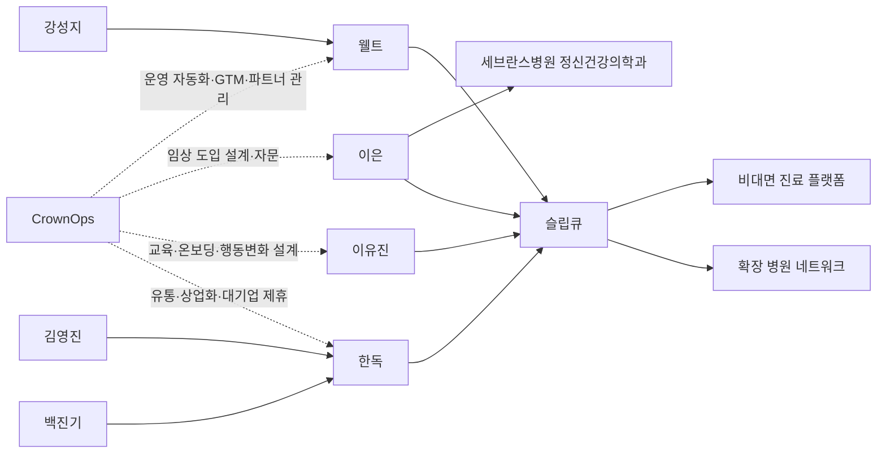

# CrownOps 관점 KDTeX 연자·임원 심층 리서치

## Executive Summary

이번 조사에서 사용자가 참고로 제시한 KDTeX 원문 페이지는 웹 브라우징 환경에서 반복적으로 타임아웃이 발생해 직접 확인하지 못했습니다. 따라서 본 결과물은 **KDTeX 원문 명단 전체의 완전 재현본이 아니라**, 공개 웹에서 직접 검증 가능한 국내 디지털치료제 상용화 축의 인물들만 추려 만든 **고신뢰 베스트에포트 버전**입니다. citeturn9view0turn20view0

검증 가능한 공개 정보만 놓고 보면, 지금 CrownOps와의 사업 연계성이 가장 높은 축은 **웰트–세브란스–한독**입니다. 특히 강성지는 상용화·비대면 처방·해외확장까지 동시에 보고 있는 운영형 대표이고, 이은은 임상 신뢰도를 붙여주는 KOL, 김영진은 제약·유통·시장접근 측면의 상위 의사결정자라는 점에서 우선 접촉 가치가 높습니다. citeturn40view0turn46view0turn46view1turn47view0turn52view0turn66view0

사용자가 요청한 스키마에 맞춘 스프레드시트는 이 세션에서 **Google Sheets에 직접 쓰기 대신**, 동일 열 구조의 XLSX/CSV 파일로 생성했습니다. 다운로드 링크는 아래 산출물 섹션에 포함했습니다.

## 조사 범위와 한계

가장 중요한 한계는 출발점이 된 KDTeX 페이지를 직접 열람하지 못했다는 점입니다. 사용자가 제공한 원문 URL과 KDTeX 도메인 루트 모두 브라우저에서 타임아웃이 발생했습니다. 따라서 “KDTeX 페이지에 명시된 모든 연자·임원”을 완전하게 다시 적어 넣는 방식의 조사로는 마무리할 수 없었습니다. citeturn9view0turn20view0

그래서 이번 보고서는 방법을 바꿨습니다. 원문 명단 추출 대신, **공식 기관·회사 페이지와 주요 보도에서 직접 검증 가능한 인물**만 남기는 방식으로 범위를 좁혔고, 그중에서도 **실제 상용 제품·병원 처방·제약 협업·비대면 유통**이 확인되는 인물들을 우선 대상으로 삼았습니다. 이 기준으로 보면 가장 정보 밀도가 높은 축이 웰트의 불면증 디지털치료기기 ‘슬립큐’, 세브란스병원 정신건강의학과, 한독의 디지털헬스케어 사업 포트폴리오였습니다. 한독 공식 제품 페이지에는 디지털헬스케어 카테고리의 제품으로 웰트의 슬립큐가 노출돼 있고, 웰트 공식 페이지와 주요 언론 보도는 이 제품의 처방·임상·유통·해외확장 상황을 비교적 구체적으로 보여줍니다. citeturn66view0turn40view0turn46view1turn47view0turn65view0

실무적으로는 이 한계가 오히려 정리 방향을 선명하게 만들었습니다. CrownOps 세부 사업이 아직 미지정인 상황에서는, **“누가 실제로 운영 복잡도가 높은 디지털헬스 사업을 굴리고 있는가”**가 가장 중요한 선별 기준입니다. 그 관점에서 이번 우선순위 정리는 비교적 실용적입니다. 임상현장, 디지털치료제 상용화, 제약 협업, 비대면 운영, 해외 현지화가 한 축에서 만나는 인물들이기 때문입니다. citeturn46view0turn46view1turn47view0turn65view0turn66view0

## 핵심 인사이트

현재 공개 웹에서 가장 분명하게 보이는 사업 구조는 다음과 같습니다. **웰트가 디지털치료기기를 만들고**, **세브란스병원 정신건강의학과 이은 교수팀이 임상·처방 접점을 만들며**, **한독이 공동개발·유통 축에 서고**, **비대면 진료 플랫폼을 통해 환자 접근성을 확장**하는 구조입니다. 이 구조는 CrownOps가 만약 헬스케어 운영 자동화, 병원/제약 파트너 온보딩, 디지털 제품 고객성공, 엔터프라이즈 워크플로우, B2B SaaS 운영체계 같은 사업을 한다면 꽤 직접적으로 맞닿습니다. citeturn46view1turn47view0turn66view0turn40view0

강성지는 특히 중요합니다. 전자신문 인터뷰에서 그는 슬립큐를 단순한 앱이 아니라 환자 데이터를 수집·분석하고, 궁극적으로 약·기기·건기식 등으로 확장 가능한 플랫폼 접점으로 설명했습니다. 같은 인물은 2025년 인터뷰에서 비대면 처방과 AI 의사 ‘쌤’을 통한 수면관리, 그리고 폭식증·우울증 등 후속 DTx 확장 계획까지 언급했습니다. 즉, 이 인물은 제품 그 자체보다 **운영 체계와 확장형 사업 구조**를 보는 사람입니다. CrownOps가 “운영”에 강점이 있다면 가장 먼저 대화할 가치가 높은 이유가 여기 있습니다. citeturn46view0turn47view0

이은은 영업보다 검증의 축입니다. 공개 자료에서 그는 세브란스병원 정신건강의학과 교수로 소개되고, 슬립큐 개발 참여자로 명시되며, 2024년에는 그의 팀이 세브란스에서 환자에게 슬립큐를 처음 처방한 것으로 보도됐습니다. CrownOps가 의료형 제품이라면, 이은은 곧바로 “고객”이라기보다 **정당성·적응증·임상 워크플로우를 잡아주는 자문 축**으로 봐야 합니다. citeturn40view0turn46view1

김영진과 백진기는 한독 측 접점입니다. 한독 공식 사이트는 두 사람을 대표로 표기하고 있고, 회사는 디지털헬스케어 사업 카테고리와 미디어룸을 통해 슬립큐, NECA 등록 1,000건, AI 기반 지능형 공장 구축 등 디지털 전환 활동을 지속 노출하고 있습니다. 특히 한독 제품 페이지에 현재 보이는 디지털헬스케어 제품이 슬립큐 중심이라는 점은, 적어도 공개 포트폴리오 기준으로 이 축이 한독 내부에서 의미 있는 파일럿/사업영역임을 시사합니다. CrownOps가 제약·헬스케어 대기업의 운영 자동화나 파트너 관리에 들어가려면 이 축을 무시하면 안 됩니다. citeturn52view0turn65view0turn66view0

## 우선순위 분포

아래 차트는 이번 베스트에포트 표본에서 제가 매긴 네트워킹 우선순위 분포입니다. 기준은 **사업 직접성**, **공개 신호의 강도**, **CrownOps와 연결될 운영 복잡도**, **소개·파일럿 가능성**이었습니다.

이번 표본에서는 **높음 3명, 중간 2명, 낮음 0명**으로 정리했습니다. 실무적으로는 “높음” 그룹만 먼저 움직여도 충분합니다. 이유는 이 다섯 명 중에서도 실제로 당장 대화를 열 가치가 큰 사람은 강성지, 이은, 김영진 세 명으로 사실상 압축되기 때문입니다.

## 인물별 정리

### 강성지

웰트 공식 페이지는 강성지를 웰트의 대표자로 표기하고 있고, 같은 페이지에서 슬립큐의 고객센터 전화와 이메일, 카카오 채널 등 공개 접점을 제공합니다. 전자신문 인터뷰에서는 슬립큐의 상용화, 독일 지사 설립, IFA 2024 참가, 섭식장애·마약중독 후속 파이프라인을 직접 설명했고, 한국경제 인터뷰에서는 비대면 진료 플랫폼과 AI 의사 ‘쌤’을 활용한 수면관리, 폭식증 DTx 허가, 우울증 DTx 계획까지 공개했습니다. citeturn40view0turn46view0turn47view0

CrownOps와의 연결은 가장 직접적입니다. 이 사람은 단순 제품 대표가 아니라 **복잡한 파트너 운영 구조를 가진 사업 운영자**입니다. 병원, 제약사, 비대면 진료 플랫폼, 보험, 환자 리텐션, 해외 현지화가 모두 한 사업 안에 들어와 있고, 이것은 운영 자동화·프로세스·GTM 인프라·고객성공 툴의 필요성이 높은 구조입니다. citeturn46view0turn47view0

권장 액션은 네 가지입니다.
- 공통 지인을 통한 소개 요청과 함께, “헬스케어 운영 복잡도 해소”라는 한 문장 가치제안을 먼저 던지기
- 슬립큐의 병원/비대면/환자운영 흐름을 맵핑하는 30분 discovery call 제안
- 독일 현지화나 해외 파트너 운영에 맞는 운영 스택 PoC 제안
- 환자 리텐션, 파트너 온보딩, 운영 대시보드 자동화 범위의 짧은 진단 워크숍 제안

### 이은

웰트 공식 페이지는 이은을 “세브란스병원 정신건강의학과 전문의 이은 교수”이자 슬립큐 개발 참여 교수로 공개하고 있습니다. 또 코메디닷컴 보도에 따르면 2024년 6월 세브란스병원 정신건강의학과 이은 교수팀이 불면증 환자에게 슬립큐를 최초 처방했습니다. 이 인물은 상업화보다 **임상 도입의 문턱을 실제로 넘긴 사람**으로 보는 것이 맞습니다. citeturn40view0turn46view1

CrownOps가 의료형 서비스라면, 이은은 “고객 확보”보다 “도입 정당성 확보”에 가깝습니다. 디지털치료제나 헬스케어 운영 솔루션은 결국 임상현장에서 workflows를 어지럽히지 않아야 살아남는데, 이은 같은 KOL은 그 현실 검증을 해줄 수 있습니다. 특히 병원 파일럿, 적응증별 도입장벽, 실제 진료흐름에서의 데이터·알림·상담·순응도 요구사항을 짚어줄 가능성이 큽니다. citeturn46view1

권장 액션은 다음이 현실적입니다.
- 직접 영업보다 공동연구 또는 임상 워크플로우 자문 요청으로 접근
- “병원 현장에서 실제 안 쓰이는 이유”를 듣는 인터뷰 미팅 제안
- 학회 또는 세미나에서 임상 도입 관점의 비공개 라운드테이블 제안
- CrownOps 기능을 의료진 사용성 관점에서 리뷰해 달라는 짧은 자문 요청

### 이유진

웰트 공식 페이지는 이유진을 MD, MPH이자 정신건강의학과 전문의, 그리고 “(전) 세브란스 병원” 경력의 공개 의료진으로 소개합니다. 페이지 내 문구에서 그는 임상 경험과 데이터를 바탕으로 슬립큐의 효과성을 설명하는 역할로 배치되어 있습니다. 다만 현재의 주 소속기관이나 직통 공개 연락처는 공식 페이지 기준으로는 확인되지 않았습니다. citeturn40view0

이유진의 가치는 임상 권위 자체보다 **제품 설명력과 사용자 순응도 설계**에 있습니다. CrownOps가 환자든 병원이든 사용자의 온보딩, 교육, 행동변화 설계를 다루는 제품이라면, 이 인물은 “무엇을 어떻게 설명해야 실제로 따라오게 되는가”에 대해 구체적 피드백을 줄 수 있는 인터뷰 대상입니다. citeturn40view0

권장 액션은 간단하게 가져가는 편이 좋습니다.
- 사용자 온보딩 문구와 FAQ에 대한 전문가 리뷰 요청
- 행동변화 메시지 설계에 대한 30분 인터뷰 제안
- 콘텐츠/알림/리마인드 구조의 임상 친화성 검토 요청

### 김영진

한독 공식 사이트는 김영진을 백진기와 함께 대표로 표기합니다. 동시에 2024년 보도에서는 김영진 한독 회장이 슬립큐가 의료진과 환자 모두에게 개선된 이점을 제공하고, 불면증 인지행동치료 참여율을 높일 것이라고 발언한 것으로 소개됩니다. 한독은 공식 사이트에서 디지털헬스케어 카테고리를 운영하고 있고, 제품 페이지에서는 웰트의 슬립큐를 디지털헬스케어 제품으로 노출합니다. 미디어룸에서는 2026년 7월 기준 슬립큐 NECA 등록 1,000건과 AI 기반 지능형 공장 관련 소식까지 공개하고 있습니다. citeturn52view0turn46view1turn66view0turn65view0

CrownOps 관점에서 김영진의 핵심 가치는 유통과 상업화입니다. 강성지가 제품·운영자라면, 김영진은 **제약·헬스케어 대기업 관점에서 디지털 사업을 붙일 수 있는 상위 파트너**입니다. CrownOps가 헬스케어 운영 SaaS, 엔터프라이즈 AI, 파트너 운영 포털, 영업/운영 자동화에 강하다면, 이 인물 라인이 더 큰 조직과 더 큰 예산으로 연결될 수 있습니다. citeturn52view0turn65view0turn66view0

권장 액션은 다음 순서가 좋습니다.
- 한독 디지털헬스/신사업 담당과의 소개 요청
- “운영 효율 개선”이나 “파트너 실행력 향상” 중심의 짧은 제안서 전달
- 공동세일즈 또는 채널협업 가능성 탐색
- 규제·시장접근 관점 자문 미팅 제안

### 백진기

한독 공식 사이트는 백진기를 김영진과 함께 대표로 표기하고 있습니다. 공개 웹에서 개인 명의 인터뷰나 발표는 상대적으로 적지만, 회사 차원에서는 슬립큐 NECA 등록 1,000건, AI 응용제품 신속 상용화 지원사업 선정, 디지털헬스케어 카테고리 운영 등 실행 활동이 계속 관찰됩니다. 즉, 대외 노출보다 **실행 라인 관점의 접점 가능성**이 더 커 보입니다. citeturn52view0turn65view0turn66view0

CrownOps가 조직 운영, 실무 도입, 프로세스 개선에 강하다면 백진기 접점은 의외로 가치가 큽니다. 상위 비전보다도 실제 도입 범위, 예산, 현업 스폰서, 내부 조달 구조 등은 이런 라인에서 풀리는 경우가 많기 때문입니다. 다만 공개 신호가 강성지·김영진보다 약하므로 우선순위는 한 단계 낮게 두는 것이 맞습니다. citeturn52view0turn65view0

권장 액션은 보수적으로 잡는 편이 좋습니다.
- 실무 운영팀 또는 디지털 전환 조직 소개 요청
- 내부 운영 pain point를 듣는 인터뷰 제안
- 작게 시작하는 automation PoC 범위 제시
- 조달·승인 프로세스 확인

## 산출물

이번 조사 결과를 요청한 열 구조에 맞춰 정리한 다운로드 파일입니다.

- [스프레드시트 XLSX 다운로드](sandbox:/mnt/data/CrownOps_KDTeX_best_effort_research.xlsx)
- [CSV 다운로드](sandbox:/mnt/data/CrownOps_KDTeX_best_effort_research.csv)
- [우선순위 차트 PNG 다운로드](sandbox:/mnt/data/network_priority_distribution.png)

포함 열은 사용자가 요청한 기본 열인 **이름, 현재 직책/소속, 전문분야/키워드, 최근 활동, 공개 연락처/프로필 URL, CrownOps와의 연관성, 기대되는 도움, 우선순위, 출처 URL, 비고**를 모두 담았고, 실무 활용을 위해 **핵심요약**과 **실질적 액션 제안** 열도 추가했습니다.

직접 Google Sheets 링크에 쓰는 작업은 이 세션 환경에서 완료하지 못했습니다. 대신 같은 스키마로 바로 업로드 가능한 파일을 만들어 두었습니다. 실무적으로는 이 XLSX를 그대로 해당 시트에 가져오기 하거나, CSV로 붙여넣으면 됩니다.

## 관계도

아래 관계도는 공개 웹에서 직접 확인된 연결만 단순화해 그린 것입니다. 핵심은 **웰트–세브란스–한독**이 이미 실제 제품과 임상·유통으로 연결된 축이고, CrownOps는 그 옆에서 운영 자동화·도입 관리·파트너 실행툴로 포지셔닝하는 편이 가장 현실적이라는 점입니다. 웰트 공식 페이지는 세브란스·가톨릭대서울성모병원·서울대병원 등 다수의 병원명을 노출하고 있고, 코메디닷컴은 세브란스 이은 교수팀의 최초 처방을 보도했으며, 한독 제품 페이지는 슬립큐를 자사 디지털헬스케어 카테고리에 올려두고 있습니다. 한국경제는 여기에 비대면 진료 플랫폼 연계를 더해 환자 접근 모델이 확장됐다고 설명합니다. citeturn40view0turn46view1turn66view0turn47view0

이 관계도에서 가장 실무적인 공략 순서는 **강성지 → 이은 → 김영진 → 백진기 → 이유진**입니다. 강성지와 먼저 문제정의를 맞추고, 이은으로 임상 현실성을 검증한 뒤, 김영진/백진기 라인으로 조직적 파트너십을 넓히는 흐름이 가장 자연스럽습니다. citeturn46view0turn46view1turn52view0turn65view0