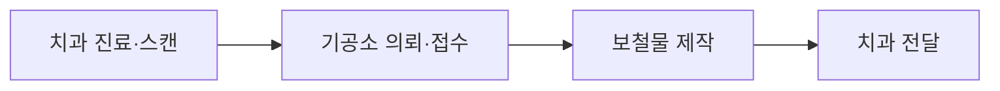
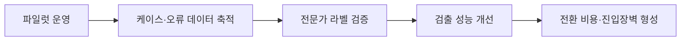

(26.07.21) 하나소셜벤처_사업계획서_구성안 v4.0 -> 반영 내용

# CrownOps IR 슬라이드별 수정사항

> 검토 대상: `(26.07.22) 하나소셜_CrownOps_사업계획서(3).pdf`  
> 페이지 기준: PDF 표지와 마지막 표지를 제외한 기존 본문 1~11번  
> 목적: 전달받은 피드백을 실제 수정 작업 단위로 변환

## 3줄 요약

- 문제 인식은 `오류 발생 위치 → 손실 데이터 → 반복되는 구조적 원인` 순서로 보강하고, 모든 핵심 수치에 출처를 붙인다.
    
- 기존 솔루션 5~7번은 본문에서 제거하고 `대표 기능 소개 1장 + 워크플로우 위 3개 검증 게이트 1장`으로 압축한다.
    
- 비즈니스 모델은 월 50만 원 기준의 ROI를 보여주고, 시장·트랙션·팀 슬라이드를 확대하며 세부 기술과 계산은 부록으로 이동한다.
    

---

## 1. 권장 발표 덱 구성

|개편 후 순서|슬라이드|상태|핵심 메시지|
|--:|---|---|---|
|표지|CrownOps 소개|유지|고치기 전에 미리 막는 AI|
|1|문제 제기|수정|오류는 제작자가 아니라 넘어오는 정보에서 시작된다|
|2|치과-기공소 워크플로우|**신규**|오류는 치과 의뢰와 제작 시작 사이에서 유입된다|
|3|재제작 규모와 비용 부담|수정|원인은 치과에서 발생하지만 비용은 기공소가 부담한다|
|4|오류 발생 상세 과정|수정|접수·설계·가공·배송 중 검증 공백에서 오류가 반복된다|
|5|근본 원인|**신규**|책임 분리·협상력 비대칭·표준 및 투자 주체 부재가 문제를 고착시킨다|
|6|솔루션 대표 기능|**신규 구성**|CrownOps는 제작 전 정보를 모아 누락과 불일치를 검증한다|
|7|3개 검증 게이트|**신규 구성**|접수·설계·배송 단계마다 필요한 검증을 추가한다|
|8|비즈니스 모델|전면 수정|기공소 대상 월 구독형 SaaS|
|9|고객 ROI|전면 수정|재제작 3건만 예방해도 월 구독료를 회수한다|
|10|시장 규모 및 확장|전면 수정|기공소에서 치과로, 국내에서 글로벌로 확장한다|
|11|트랙션 및 실행 현황|전면 수정|개발·영업·데이터 및 제휴의 진행 상태를 증명한다|
|12|팀 및 협력 네트워크|**신규**|이 문제를 실행할 수 있는 팀과 현장 네트워크가 있다|
|마무리|CrownOps 소개·QR|유지|발표 종료 및 연락 유도|

### 본문에서 부록으로 이동할 내용

1. 기존 5번: 접수 검증 상세
    
2. 기존 6번: 스캔 대조 상세
    
3. 기존 7번: 배송 및 가공 단계 상세
    
4. 기존 9번: 재제작 1건당 손실 세부 계산
    
5. 기존 11번: 소셜 임팩트의 세부 내용
    
6. 덴티룸 소개 및 유입 구조
    
7. AI 기능별 개발 난이도·성능 검증·개발 로드맵
    
8. 데이터 확보 및 모델 고도화 전략
    

---

# 2. 기존 슬라이드별 수정사항

## 기존 1번 — 문제 제기

### 현재

- 제목: `오류는 왜 항상 다 만든 뒤에야 발견될까요?`
    
- 파일 오류, 의뢰서 오류, 인상 채득 오류, 재료·케이스 매칭 오류를 나열함.
    

### 수정

- 현재 질문형 헤드라인은 유지한다.
    
- 오류 유형을 모두 설명하지 말고, 아래 메시지만 전달한다.
    
    - `실수는 대부분 제작 과정이 아니라 치과에서 기공소로 넘어오는 정보에서 시작됩니다.`
        
- 4개 오류 유형은 작은 태그로만 남긴다.
    
- 하단에 다음 슬라이드로 이어지는 문장을 추가한다.
    
    - `그렇다면 오류는 전체 제작 과정 중 어디에서 유입될까요?`
        

### 발표 시 언급

> 보철물 오류는 완성 후 발견되지만, 실제 원인은 제작 전에 넘어온 정보에 있는 경우가 많습니다.

### 디자인

- 현재 어두운 배경과 중앙 질문 구조는 유지 가능하다.
    
- 주황색 강조는 `넘어오는 정보` 한 곳에만 사용한다.
    
- 태그 4개는 발표자가 읽지 않고 시각적 보조로만 활용한다.
    

---

## 신규 2번 — 치과-기공소 초간단 워크플로우

### 목적

기존 1번과 2번 사이에 추가하여 비전문 심사위원도 전체 흐름과 오류 유입 지점을 즉시 이해하게 한다.

### 권장 구성

- `치과 진료·스캔 → 기공소 의뢰·접수` 사이를 주황색 또는 빨간색으로 강조한다.
    
- 해당 구간 위에 경고 아이콘과 다음 문구를 배치한다.
    
    - `오류 정보 유입`
        
    - `불완전한 인상·누락된 의뢰 정보·파일 불일치`
        
- 제작 완료 후 치과 전달 단계에는 다음 문구를 배치한다.
    
    - `오류 발견 및 재제작`
        

### 권장 헤드라인

`오류는 제작 전에 들어오지만, 완성된 뒤에 발견됩니다`

### 발표 시 언급

> 치과에서 전달된 임상 정보와 파일에 문제가 있어도, 기공소는 제작을 시작합니다. 검증 장치가 없기 때문에 오류는 완성 후 발견됩니다.

---

## 기존 2번 → 개편 3번 — 재제작 규모와 비용 부담

### 현재

- 재제작 발생 비율 10.1%
    
- 재제작 원인 중 임상 인상 오류 63.7%
    
- 재제작 비용 중 기공소 부담 67.4%
    
- 국내 기공소 수 4,635개
    

### 내용 수정

- 제목을 결과 중심으로 바꾼다.
    
    - 기존: `부담은 치과기공소가 떠안는 구조입니다`
        
    - 권장: `원인의 63.7%는 치과, 비용의 67.4%는 기공소가 부담합니다`
        
- 슬라이드 하단의 `대부분이 아날로그 방식 운영`은 근거가 없다면 삭제하거나 출처를 붙인다.
    
- 재제작으로 발생하는 연간 손실 규모를 한 줄로 추가한다.
    
    - 예시: `월 200건 기공소 기준, 재제작으로 연간 최대 약 4,800만 원 손실`
        
    - 세부 산식은 부록으로 이동한다.
        

### 출처 수정

10.1%, 63.7%, 67.4%는 반드시 다음 중 하나로 표기한다.

- 외부 통계인 경우
    
    - `출처: 기관명, 보고서명, 발행연도, p.00`
        
- 자체 조사인 경우
    
    - `출처: CrownOps 치과기공소 예비조사, n=○○, 2026.○○~○○`
        
    - 조사 대상과 질문 방식이 다르면 각 수치별 표본 수를 별도로 적는다.
        

출처가 확정되지 않으면 IR 본문에서 확정적 산업 통계처럼 사용하지 않는다.

### 숫자 정합성

- 현재 덱의 기공소 수가 `4,635개`, `4,663개`, `4,66개`로 불일치한다.
    
- 최신 공신력 있는 동일 기준 자료를 확인한 뒤 **하나의 숫자와 기준연도**로 전 슬라이드를 통일한다.
    
- `사업체 수`, `개설 기공소 수`, `등록 기공소 수`가 서로 다른 개념인지도 확인한다.
    

### 디자인

- 살구색 숫자는 배경과 겹치므로 진한 차콜 또는 짙은 주황색으로 변경한다.
    
- 핵심 숫자 `10.1% / 63.7% / 67.4%`는 현재 대비 약 2배 확대한다.
    
- 각 숫자 아래 설명은 1줄로 제한한다.
    
- 출처 각주는 하단에 최소 가독 크기로 정렬하되, 발표 화면에서 읽을 수 있어야 한다.
    

---

## 기존 3번 → 개편 4번 — 오류 발생 상세 과정

### 현재

- 치과·의뢰서·기공소·CAD·CAM·밀링·소결·후처리 과정이 한 흐름에 표시됨.
    
- 오류가 발생하는 4개 접점이 있으나 강조가 약함.
    

### 수정

- 신규 2번의 단순 워크플로우를 확장한 상세 버전으로 사용한다.
    
- 문제가 주로 발생하는 과정만 주황색 또는 빨간색으로 칠한다.
    
    1. 치과의 인상 채득·구강 스캔
        
    2. 치과에서 기공소로 의뢰 정보·파일 전달
        
    3. 기공소 접수 후 의뢰서와 파일 매칭
        
    4. CAD 설계 전 스캔 품질 확인
        
- 오류와 직접 관련 없는 후반 공정은 회색으로 약화한다.
    
- 현재의 복잡한 되돌림 화살표는 최소화하고 `오류 발견 → 치과 재요청 → 재제작`만 남긴다.
    

### 권장 헤드라인

`검증 없이 넘어간 오류는 제작 전 과정에 누적됩니다`

### 발표 시 언급

- 전체 공정을 순서대로 읽지 않는다.
    
- 강조된 오류 유입 과정만 약 15초 내로 설명한다.
    

> 오류는 주로 치과의 인상 채득과 정보 전달, 그리고 기공소의 제작 전 확인 단계에서 발생합니다. 하지만 이를 체계적으로 검증하는 장치가 없어 그대로 제작으로 넘어갑니다.

---

## 신규 5번 — 문제가 20년째 해결되지 않은 근본 원인

### 권장 헤드라인

`오류가 반복되는 이유는 개인의 실수가 아니라 구조의 문제입니다`

### 권장 구성

|근본 원인|현재 구조|결과|
|---|---|---|
|비용 부담 주체와 오류 유발 주체의 분리|원인의 63.7%는 치과 측 임상 인상 오류, 비용의 67.4%는 기공소 부담|오류 예방 투자 유인이 분리됨|
|협상력 비대칭|기공소는 거래처 이탈을 우려해 불완전한 의뢰를 반려하기 어려움|확인되지 않은 케이스도 제작에 착수|
|표준 부재|의뢰서 양식·파일명·전달 채널이 치과마다 다름|자동 대조와 이력 관리가 어려움|
|규모화·R&D 투자 주체 부재|관련 법·제도상 개설 및 법인화 제약|산업 공통 검증 시스템 투자가 지연됨|

### 의료기사법 내용 이동

- 기존 11번 소셜 임팩트에 있던 의료기사법 내용을 이 슬라이드로 이동한다.
    
- 단, `법인 설립 불가`, `지분 투자 차단`, `업계 자체 혁신 불가`는 강한 법률 해석이므로 조문과 실제 적용 범위를 법률 전문가 또는 공신력 있는 해설로 검증한다.
    
- 검증 전에는 다음처럼 보수적으로 표현한다.
    
    - `현행 개설 자격 및 운영 형태의 제약으로 규모화와 외부 투자 유치가 어렵습니다.`
        
- `20년째 해결되지 않았다`는 표현을 쓰려면 기준 시점이나 근거가 필요하다. 근거가 없다면 `오랫동안 해결되지 못한 구조입니다`로 수정한다.
    

### 디자인

- 원인 4개를 동일한 크기의 카드로 나열하지 말고, 왼쪽에서 오른쪽으로 `원인 → 구조 고착 → 반복 재제작`의 흐름을 만든다.
    
- 핵심 수치 63.7%와 67.4%는 기존 3번 슬라이드와 동일한 출처를 재사용한다.
    
- 법률 조항은 본문을 길게 싣지 말고 각주로 처리한다.
    

---

## 기존 4~6번 → 부록 이동

기존 본문 4번 `제작 전 조건을 먼저 분리합니다`, 5번 `스캔을 대조합니다`, 6번 `배송까지 검증하고, 가공은 함께 만듭니다`는 현재 번호 기준으로 각각 기존 5~7번에 해당한다.

### 공통 수정

- 세 장 모두 본문에서 제거하고 부록으로 이동한다.
    
- 본문에서는 아래의 개편 6번과 7번 두 장으로 기능을 압축한다.
    
- 부록에서도 기능이 구현 완료된 것처럼 보이지 않도록 상태 배지를 붙인다.
    
    - `구현 완료`
        
    - `개발 중`
        
    - `현장 검증 예정`
        

---

## 개편 6번 — 솔루션 대표 기능

### 목적

세부 작동 방식보다 먼저 CrownOps가 무엇을 하는 제품인지 한눈에 보여준다.

### 권장 헤드라인

`흩어진 제작 정보를 한 화면에 모아, 제작 가능 여부를 먼저 판단합니다`

### 화면 구성

- 슬라이드 오른쪽 또는 중앙에 기존 6번의 3D 스캔 뷰어 또는 실제 제품 화면을 크게 배치한다.
    
- 왼쪽에는 기능 3~4개만 `~를 통해 ~를 해결` 형태로 제시한다.
    

### 권장 기능 문구

1. `의뢰서·스캔 파일 자동 매칭을 통해 케이스 혼선을 줄입니다.`
    
2. `필수 정보 누락 탐지를 통해 제작 전 재확인을 요청합니다.`
    
3. `스캔 형상 검증을 통해 마진·대합치·스캔 범위 이상을 확인합니다.`
    
4. `최종 케이스·라벨 대조를 통해 오배송과 케이스 불일치를 막습니다.`
    

### 디자인

- 기능 설명은 최대 4개, 각 2줄 이내로 제한한다.
    
- 제품 화면은 장식용 목업보다 실제 검증 결과가 보이는 화면을 우선한다.
    
- 구현 전 기능은 `예정` 또는 `개발 중`을 명확히 표시한다.
    

---

## 개편 7번 — 워크플로우 위 3개 검증 게이트

### 권장 헤드라인

`CrownOps는 기존 공정을 바꾸지 않고 세 번의 검증을 더합니다`

### 권장 구성

문제 인식에서 사용한 동일 워크플로우를 재사용하고, 그 위에 세 개의 게이트만 추가한다.

|게이트|적용 단계|핵심 기능|검증 결과|
|---|---|---|---|
|Gate 1 접수 검증|기공소 의뢰·접수 전후|의뢰서 파싱, 파일 도착 여부, 파일명·치식·재료·쉐이드 일치 확인|제작 가능 / 확인 필요|
|Gate 2 설계 검증|CAD 설계 전|마진 명확도, 대합치 포함 여부, 스캔 범위·스캔바디 확인|설계 가능 / 재확인·재스캔|
|Gate 3 배송 검증|치과 전달 전|보철물·케이스·라벨 최종 대조|배송 가능 / 불일치|

### 발표 시 언급

> 접수에서는 정보 누락을, 설계 전에는 스캔 형상을, 배송 전에는 케이스와 라벨을 검증합니다. 기존 CAD·CAM을 대체하는 것이 아니라 각 공정 사이에 검증 게이트를 추가합니다.

### 기존 문구 이동

- `가공 단계는 현장과 함께 만들어가는 중`은 솔루션 본문에서 삭제한다.
    
- 트랙션의 개발 현황 또는 부록의 로드맵에 `가공 검증: 파트너 기공소와 정의 중`으로 이동한다.
    

---

## 기존 7번 → 개편 8번 — 비즈니스 모델

### 현재 문제

- 제품 위치, 치과-기공소 관계, 덴티룸, 무료 파일럿, 가격이 한 장에 섞여 있다.
    
- 텍스트가 많고 살구색 숫자의 가독성이 낮다.
    

### 삭제

- `제작 시작 전, 아무도 없었던 자리에 들어갑니다`
    
- `기존 소프트웨어를 대체하지 않습니다`
    
- 덴티룸 및 사용자 유입 구조
    
- 재제작 발생 시 손실 설명
    
- 무료 500건·월 10만 원·월 30~50만 원 원형 3개
    

### 수정

- 제목을 단순히 `비즈니스 모델`로 변경한다.
    
- 고객과 과금 구조만 남긴다.
    
    - 고객: 성장형 디지털 치과기공소
        
    - 상품: 제작 전 공정 검증 SaaS
        
    - 과금: 기공소당 월 50만 원
        
    - 장기 확장: 사용량 또는 고급 검증 기능에 따른 상위 요금제
        
- `월 10만 원`은 향후 대표 ARPU로 사용하지 않는다.
    
    - 필요하면 `초기 유료 전환 프로모션` 또는 부록의 가격 검증 과정으로만 표시한다.
        

### 권장 화면

`치과기공소 → 월 50만 원 구독료 → CrownOps → 접수·설계·배송 검증 리포트`

### 디자인

- `월 50만 원`을 가장 크게 표시한다.
    
- 가격과 핵심 제공 가치 외의 텍스트는 최소화한다.
    
- 강조색은 진한 주황색 또는 차콜을 사용하고 살구색 대형 숫자는 피한다.
    

---

## 기존 8번 → 부록 / 일부를 개편 9번으로 이동

### 현재 문제

- `재제작 소요 시간 | 8만 원`처럼 시간 항목에 금액이 들어간 오타가 있다.
    
- 직접 손실, 기회비용, 월·연 손실이 한 장에 과도하게 들어가 있다.
    

### 부록에 남길 내용

- 직접 손실 11~13만 원
    
- 기회비용 약 8만 원
    
- 건당 총 손실 약 19~21만 원
    
- 재료비·인건비·전기세·배달비 세부 산식
    

### 문구 정정

- 잘못된 문구: `재제작 소요 시간 | 8만 원`
    
- 수정 문구: `재제작 소요 시간 | 약 8시간`
    
- 비용 근거와 시간 근거는 각각 별도의 출처를 붙인다.
    

### 문제 인식 슬라이드로 이동

- 문제 인식에는 세부 항목을 넣지 않고 다음 결과만 한 줄로 넣는다.
    
    - `월 200건 기공소 기준, 연간 재제작 손실 최대 약 4,800만 원`
        

---

## 개편 9번 — 구독료가 합리적인 이유

### 권장 헤드라인

`재제작 3건만 예방해도 월 구독료를 회수합니다`

### 권장 계산

|항목|계산|결과|
|---|--:|--:|
|월 제작량|200건|200건|
|재제작률|10%|월 20건|
|건당 총 손실|약 20만 원|-|
|월 잠재 손실|20건 × 20만 원|약 400만 원|
|CrownOps 구독료|월 50만 원|월 50만 원|
|손익분기 예방 건수|50만 원 ÷ 20만 원|약 3건|

### 연간 비교

- 기존 연간 잠재 손실: `약 4,800만 원`
    
- 연간 구독료: `600만 원`
    
- 구독료는 기존 잠재 손실의 `12.5%`
    
- 단순 비용 비교 기준으로 약 `87.5% 낮은 금액`
    

### 표현 주의

- `손실이 4,800만 원에서 600만 원으로 줄어든다`고 단정하면 안 된다.
    
- 600만 원은 **서비스 비용**이고, 실제 남는 재제작 손실은 검출률과 현장 대응률에 따라 달라진다.
    
- 따라서 다음처럼 표현한다.
    
    - `연간 잠재 손실 4,800만 원 대비 연간 구독료 600만 원`
        
    - `월 3건 이상 예방하면 비용 회수`
        
- `약 80% 절감`을 사용하려면 파일럿에서 실제 재제작 감소율을 검증한 뒤 제시한다.
    

### 가격 단계 이동

기존 8번 하단의 가격 단계는 필요할 경우 이 슬라이드 하단에 작게 배치한다.

`무료 파일럿 → 초기 유료 검증 → 월 50만 원 정식 구독`

다만 메인 메시지는 가격 단계가 아니라 `3건 예방 시 본전`이어야 한다.

---

## 기존 9번 → 개편 10번 — 시장 규모 및 확장

### 현재 문제

- 전체 요소와 각주가 작다.
    
- 월 10만·24.9만·39.9만 원 등 가격 가정이 본문의 월 50만 원 전략과 맞지 않는다.
    
- TAM이 5개국 기공소에 한정되어 있고 치과 시장이 계산에 반영되지 않는다.
    
- 해외·국내 기공소 수의 출처가 없다.
    

### 권장 헤드라인

`기공소에서 시작해 치과로, 국내에서 글로벌 시장으로 확장합니다`

### 권장 시장 정의

|구분|대상 시장|산정 방향|
|---|---|---|
|SOM|국내 성장형·다인 치과기공소|초기 직접 판매 대상 기공소 수 × 연 600만 원|
|SAM|국내 전체 기공소 + 디지털 보철 업무가 많은 치과|국내 확장 가능 고객 수 × 고객군별 연간 ARPU|
|TAM|북미·유럽·아시아 주요국의 치과 및 기공소|국가별 고객 수 × 국가별 가격 또는 손실 기반 ARPU|

### 계산 원칙

- 월 구독료는 기본적으로 `50만 원`, 연간 `600만 원`으로 통일한다.
    
- 치과용 상품 가격이 아직 정해지지 않았다면 기공소와 같은 가격을 임의 적용하지 않는다.
    
- 치과 시장은 `향후 확장 시장`으로 표시하고, 별도 가격 가정이 확정된 뒤 SAM에 금액으로 반영한다.
    
- 글로벌 TAM은 단순히 국가 수를 늘리지 말고 북미·유럽처럼 인건비와 재제작 손실이 큰 시장을 우선한다.
    
- 국가별 기공소·치과 수와 기준연도, 환율 기준일을 각주로 표시한다.
    

### 출처 필수 항목

- 국내 치과기공소 수
    
- 국내 치과 수 또는 요양기관 수
    
- 국가별 치과기공소 수
    
- 국가별 치과 수
    
- 사용한 평균 환율
    
- 가격 가정의 근거
    

### 디자인

- 현재 겹친 원형 TAM·SAM·SOM은 글자가 작아지므로 세로 3단계 확장 구조 또는 큰 숫자 카드로 변경한다.
    
- 각 시장마다 `고객 수 × 연간 구독료 = 시장 규모` 산식을 한 줄로 표시한다.
    
- 각주를 넣을 공간을 하단에 사전에 확보한다.
    

---

## 기존 10번 — 소셜 임팩트

### 본문 처리

- 본문에서는 삭제하고 부록으로 이동한다.
    
- 의료기사법과 법인화 제약은 개편 5번 `근본 원인`으로 이동한다.
    

### 부록에 남길 내용

- 재제작 감소에 따른 재료·에너지·인력 낭비 감소
    
- 환자 치료 지연 감소
    
- 기공소 경영 안정
    
- 책임 소재 확인을 위한 데이터 축적
    

### 표현 수정

- `억울한 부담`, `전문직 권리 회복`은 메시지는 강하지만 심사 자료에서는 감정적으로 보일 수 있다.
    
- 다음처럼 사업 효과 중심으로 바꾼다.
    
    - `재제작 손실과 책임 불균형을 줄이는 산업적 효과`
        

---

## 기존 11번 → 개편 11번 — 트랙션 및 실행 현황

### 현재 문제

- 인터뷰·파일럿·조회수·부스 방문 등 활동량은 있으나 제품 개발 상태가 보이지 않는다.
    
- 영업, 개발, 데이터 확보가 섞여 있다.
    
- 팀 소개라는 제목과 달리 실제 팀 정보가 없다.
    

### 권장 헤드라인

`개발·영업·데이터 확보를 동시에 진행하고 있습니다`

### 권장 구성

|영역|항목|현재 상태|목표 시점|
|---|---|---|---|
|개발|접수 검증: 의뢰서 파싱·파일 매칭|완료 / 진행 중 중 실제 상태 표기|2026 Q3|
|개발|설계 검증: 스캔 형상 대조|실제 상태 표기|2026 Q3~Q4|
|개발|배송 검증: 케이스·라벨 매칭|실제 상태 표기|2026 Q4|
|개발|가공 검증 규칙 정의|파트너 기공소와 진행 중|2026 Q4|
|영업|심층 인터뷰 16곳|완료|완료|
|영업|파일럿 기공소 3곳|협의 중|2026 Q3|
|영업|확약서·MOU·LOI|최소 1곳 확보 목표|발표 전|
|데이터·제휴|파일럿 케이스 수집 구조|준비 / 진행 중 중 실제 상태 표기|2026 Q3|
|데이터·제휴|교수·실험실·현장 파트너 검증|실제 협의 상태 표기|2026 Q3~Q4|

### 상태 표시

- 색상과 표현을 다음 세 가지로 통일한다.
    
    - `완료`
        
    - `진행 중`
        
    - `2026 Q3 / Q4 예정`
        
- `협의 중`을 성과처럼 과장하지 않는다.
    
- 가능하다면 발표 전 최소 1개 기관에서 LOI, 확약서 또는 MOU를 확보해 다음처럼 표기한다.
    
    - `파일럿 확약 1곳 + 협의 2곳`
        

### 우선순위

현재의 `커뮤니티 조회 900회`, `KDTEX 85개 부스 방문`은 보조 활동으로 축소한다. 다음 항목을 더 크게 보여준다.

1. 기능별 MVP 개발 현황
    
2. 실제 파일럿 확약 여부
    
3. 확보·검증 가능한 케이스 데이터 규모
    
4. 현장에서 관찰한 오류 사례
    

---

## 신규 12번 — 팀 및 협력 네트워크

### 목적

예비창업 심사의 핵심인 팀 역량과 실행 가능성을 별도 슬라이드로 증명한다.

### 권장 헤드라인

`AI 개발 역량과 치과기공 현장 네트워크를 함께 갖췄습니다`

### 팀원별 필수 정보

- 이름·역할
    
- 핵심 전공 또는 직무 역량
    
- 이번 사업과 직접 연결되는 경험
    
- 현재 담당 기능
    

### 대표 정보 예시 구조

- `신은지 | 대표·AI/제품 개발`
    
- 컴퓨터공학 전공, 의료 AI 신뢰성 연구 경험
    
- 의료 LLM 신뢰성 평가 논문 및 멀티모달 AI 관련 경험
    
- CrownOps 제품 설계, AI 검증 파이프라인, 현장 인터뷰 총괄
    

실제 팀원의 역할과 이력은 최신 정보로 보완한다.

### 협력 네트워크

- 파트너 치과기공소
    
- 협력 치과 또는 실험실
    
- 자문 교수
    
- 기술·산업 협력 업체
    

### 표기 주의

- `협력`, `자문`, `MOU`, `파일럿 예정`을 구분한다.
    
- 사전 동의를 받지 않은 기관이나 교수의 로고·성명을 확정 파트너처럼 사용하지 않는다.
    
- 협의 단계라면 `협의 중`으로 명시한다.
    

---

# 3. 부록 슬라이드 수정안

## 부록 A — 접수 검증 상세

기존 5번을 활용하되 상태를 표시한다.

- 의뢰서·스캔 파일 도착 여부
    
- 의뢰서·스캔 정보 일치
    
- 재료·쉐이드 누락
    
- 스캔바디·임플란트 정보 확인
    

## 부록 B — 설계 검증 상세

기존 6번을 활용한다.

- 마진 불명확
    
- 대합치 누락
    
- 스캔 영역 부족
    
- 실제 구현·검증 수준을 기능별로 표시
    

## 부록 C — 배송·가공 검증 상세

기존 7번을 활용한다.

- 배송: 최종 케이스·라벨 검증
    
- 가공: `현장과 함께 만들어가는 중` 대신 `검증 기준 정의 중`으로 명확화
    

## 부록 D — AI 개발 난이도 및 로드맵

질문 `실제로 AI가 누락과 오류를 잡아낼 수 있는가?`에 대비한다.

|기능|기술 난이도|현재 수준|검증 방법|목표 시점|
|---|---|---|---|---|
|파일 도착·파일명 대조|낮음|실제 상태 입력|규칙 기반 테스트|2026 Q3|
|의뢰서 필드 파싱|중간|실제 상태 입력|필드별 Precision·Recall|2026 Q3|
|의뢰 정보 일치 확인|중간|실제 상태 입력|케이스 단위 정확도|2026 Q3|
|대합치·스캔 범위 누락|중상|실제 상태 입력|전문가 라벨 대조|2026 Q4|
|마진 불명확 판정|높음|실제 상태 입력|치기공 전문가 합의 라벨|2026 Q4 이후|
|가공 이상 검증|높음|요구사항 정의 중|현장 데이터 기반 검증|이후 단계|

### 성능 표현 원칙

- 규칙 기반 대조와 형상 AI 검증을 하나의 `AI 정확도`로 합치지 않는다.
    
- 의뢰서 파싱은 필드별 Precision·Recall 또는 정확도로 제시한다.
    
- 스캔 형상 검증은 오류 유형별 민감도·특이도와 전문가 일치도로 제시한다.
    
- 테스트 케이스 수와 데이터 출처를 함께 표시한다.
    

## 부록 E — 재제작 손실 산식

- 건당 직접 손실 11~13만 원
    
- 건당 기회비용 약 8만 원
    
- 건당 총 손실 약 19~21만 원
    
- 월 200건 × 재제작률 10% × 건당 약 20만 원 = 월 약 400만 원
    
- 연간 약 4,800만 원
    
- 모든 단가·시간에 출처 또는 자체 인터뷰 표본 정보를 표기한다.
    

## 부록 F — 데이터 확보 전략

### 함께 표시할 내용

- 수집 데이터: 의뢰서, STL·PLY·OBJ, 재료, 쉐이드, 임플란트 정보, 실제 재제작 결과
    
- 라벨: PASS / CHECK / RE-SCAN 또는 오류 유형별 라벨
    
- 개인정보·의료정보 비식별화, 동의, 보관 기준
    
- 데이터 수보다 `전문가 검증이 끝난 케이스 수`를 핵심 지표로 관리
    

## 부록 G — 덴티룸

- 발표 본문에서는 삭제한다.
    
- 필요할 경우 `향후 치과인 커뮤니티 기반 고객 접점` 정도로만 설명한다.
    
- CrownOps의 현재 고객 획득 경로로 검증되지 않았다면 핵심 트랙션으로 제시하지 않는다.
    

## 부록 H — 소셜 임팩트

- 재료·에너지·인력 낭비 감소
    
- 환자 치료 지연 감소
    
- 기공소 경영 안정
    
- 책임 확인을 위한 데이터 기반 형성
    

---

# 4. 전체 디자인 수정 원칙

## 가독성

- 살구색 배경 위 살구색 숫자 사용을 중단한다.
    
- 핵심 숫자는 차콜 또는 짙은 주황색으로 통일한다.
    
- 한 슬라이드의 핵심 숫자는 최대 3개로 제한한다.
    
- 본문 문장은 최대 2줄, 기능은 최대 4개만 노출한다.
    
- 각 슬라이드에서 발표자가 반드시 읽어야 할 메시지는 1개만 남긴다.
    

## 워크플로우 일관성

- 신규 2번, 개편 4번, 개편 7번은 동일한 아이콘·방향·단계명을 사용한다.
    
- 문제 슬라이드에서는 오류 지점을 주황색으로 표시한다.
    
- 솔루션 슬라이드에서는 동일 위치에 CrownOps 게이트를 덧씌운다.
    
- 심사위원이 새 도식을 다시 해석하지 않아도 되게 한다.
    

## 용어 통일

- `치과기공소`와 `기공소`는 첫 등장 후 `기공소`로 통일한다.
    
- `인상 채득 오류`, `임상 인상 오류`, `스캔 오류`는 서로 다른 범위인지 정의한 뒤 사용한다.
    
- `재제작률`로 통일하고 `재제작율`은 사용하지 않는다.
    
- `접수 검증 / 설계 검증 / 배송 검증`을 전 슬라이드에서 동일하게 사용한다.
    
- `파일럿`, `협의 중`, `확약`, `MOU`, `LOI`를 구분한다.
    

---

# 5. 숫자·출처 최종 점검표

|항목|현재 상태|수정 조치|
|---|---|---|
|재제작률 10.1%|출처 미표시|외부 출처 또는 자체 조사 n·기간 표기|
|임상 인상 오류 63.7%|출처 미표시|정의와 출처 표기|
|기공소 비용 부담 67.4%|출처 미표시|조사 질문과 표본 정보 표기|
|국내 기공소 수|4,635 / 4,663 / 4,66 혼재|기준연도·통계 정의 확인 후 하나로 통일|
|건당 직접 손실 11~13만 원|산식만 있음|항목별 출처 또는 인터뷰 표본 표기|
|건당 기회비용 약 8만 원|시간과 금액 혼재|8시간과 8만 원을 분리하고 각각 근거 표기|
|월 200건|예시인지 평균인지 불명확|`대표 기공소 예시` 또는 조사 근거 명시|
|월 구독료|10만·24.9만·39.9만·30~50만 혼재|본문은 월 50만 원으로 통일|
|시장 규모|가격 가정 불일치|고객 수 × 연 600만 원 기준으로 재산정|
|글로벌 기공소·치과 수|출처 없음|국가별 기관·연도 각주 추가|
|법률 해석|강한 단정 표현|조문·전문가 검토 후 표현 확정|

---

# 6. 수정 우선순위

## P0 — 발표 전 반드시 수정

1. 핵심 수치의 출처 확보 또는 자체 조사 표본·기간 표시
    
2. 기공소 수와 가격 등 숫자 정합성 통일
    
3. 근본 원인 슬라이드 추가
    
4. 솔루션 3장을 2장으로 압축하고 세부 내용은 부록 이동
    
5. MVP 기능별 개발 현황 추가
    
6. 팀 슬라이드 추가
    
7. 월 50만 원 기준 비즈니스 모델·시장 규모·ROI 재계산
    

## P1 — 설득력 강화를 위해 권장

1. 워크플로우 도식 통일 및 오류 지점 색상 강조
    
2. 파일럿 LOI·확약서·MOU 중 최소 1건 확보
    
3. 데이터 확보 및 모델 고도화 전략을 부록에 추가
    
4. AI 기능별 난이도와 성능 검증 방법을 분리
    

## P2 — 마감 후 다듬기

1. 살구색 강조 숫자와 작은 본문 글자 개선
    
2. 소셜 임팩트·덴티룸을 부록에서 간결하게 정리
    
3. 발표 멘트를 슬라이드당 한 문장으로 압축