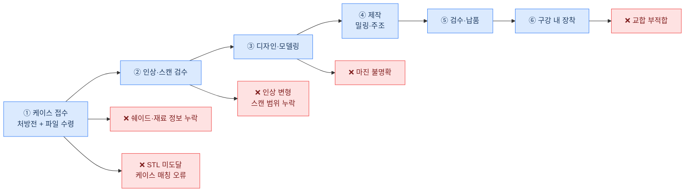

# 치과기공 워크플로우 — 오류 발생 지점

## 오류-단계 매핑 요약

| 워크플로우 단계 | 발생 오류 |
|---|---|
| ① 케이스 접수 | 쉐이드·재료 정보 누락 / STL 미도달·케이스 매칭 오류 |
| ② 인상·스캔 검수 | 인상 변형·스캔 범위 누락 |
| ③ 디자인·모델링 | 마진 불명확 |
| ⑥ 구강 내 장착 | 교합 부적합 |
