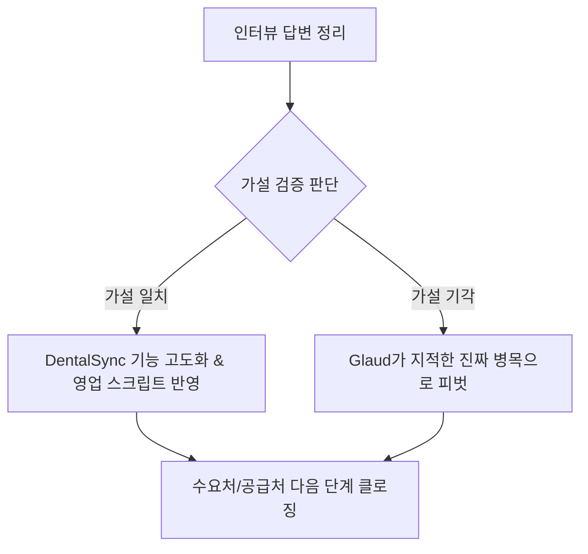

# 글라우드 / 이마고웍스 / 덴트버드

  

## 포함 원본 문서

- 개인 페이지 & 공유된 페이지/자료실/문서허브-2/CrownOps글라우드_인터뷰질문지 36e0b56c63ab80f9b24bf77cca2f1586.md

- 개인 페이지 & 공유된 페이지/자료실/문서허브-2/글라우드 VS DentSync 36d0b56c63ab80c98a6ad7760cdaeb3e.md

- 개인 페이지 & 공유된 페이지/자료실/문서허브-2/글라우드 브리핑 36e0b56c63ab80bb92e2d3e213f9cf7d.md

- 개인 페이지 & 공유된 페이지/자료실/문서허브-2/글라우드, 이마고웍스(덴트버드) 분석 3660b56c63ab802c86c4e7720c6c6c56.md

- 개인 페이지 & 공유된 페이지/자료실/문서허브-2/이마고웍스 구체적으로 36e0b56c63ab8023b6bde8eb7eaf5c47.md

- 개인 페이지 & 공유된 페이지/자료실/문서허브-2/이마고웍스 질문지 36e0b56c63ab80cfb304e0d51cb9396d.md

  

## 첨부 파일

- 없음

  

## 원문 내용

  

---

  

### 개인 페이지 & 공유된 페이지/자료실/문서허브-2/CrownOps글라우드_인터뷰질문지 36e0b56c63ab80f9b24bf77cca2f1586.md

  

# CrownOps글라우드_인터뷰질문지

  

생성: WY_L

생성 1: 2026년 5월 28일 오후 5:15

체크박스: No

카테고리: 고객 인터뷰

  

# ㈜글라우드(GLOUD) 배움 인터뷰 질문지 (Learning Session)

  

**대상:** ㈜글라우드 지진우 대표님

  

**작성일:** 2026-05-28

  

**팀/서비스:** CrownOps / DentalSync

  

**인터뷰 성격:** 단순 조사가 아닌 **‘업계 선배이자 혁신가로부터의 배움의 시간’**

  

**작성 목적:** 디지털 덴티스트리 시장의 선구자인 글라우드의 성장 궤적과 워크플로우 혁신 경험을 배우고, CrownOps의 최신 피벗 모델인 **DentalSync(치기공소 CAD-CAM-밀링 운영 검증 레이어 SaaS)**의Feasibility와 생태계 상생 가능성을 점검한다.

  

---

  

## 0. 이번 인터뷰의 목적과 핵심 가설

  

이 인터뷰는 우리의 아이템을 홍보하거나 판매하려는 자리가 아닙니다. **디지털 덴티스트리 생태계에서 ’TaaS(Treatment as a Service)’라는 파괴적 혁신을 이끌어낸 선배 기업**이 겪었던 진짜 어려움과 교훈을 겸손하게 배우는 것이 목적입니다.

  

우리가 사전에 설정한 **CrownOps / DentalSync의 핵심 가설**과 연결하여 다음과 같은 답을 얻고자 합니다.

  

### 💡 CrownOps의 핵심 가설 (DentalSync)

  

> **“치기공소의 CAD 파일이 CAM/밀링으로 넘어가는 전후 구간에서 생기는 휴먼 에러(중복, 누락, 구버전 사용, 재료/쉐이드/두께/임플란트 오선택)는 단순한 작업자 실수가 아닌 ’운영 시스템의 부재’로 발생하며, 이를 실시간 검증하는 레이어(DentalSync)는 기공소의 리메이크 비용을 획기적으로 줄이고 치과의 신뢰도를 높인다.”**

>

  

### 🎯 글라우드로부터 검증받고 싶은 질문

  

1. 글라우드가 ’저스트스캔’을 운영하며 클라우드 기반 원격 기공/디자인 시스템을 구축했을 때, **실제 파일 전달 및 기공 프로세스에서 가장 빈번하게 발생한 휴먼 에러와 예외 상황**은 무엇이었는가?

2. 고도로 숙련된 치기공사와 개발자가 협업하는 과정에서, **임상 데이터의 복잡성(쉐이드, 교합 오차 등)을 IT 시스템으로 표준화하고 검증할 때 직면한 한계와 극복 방법**은 무엇이었는가?

3. 치과의사와 치기공소라는 극도로 보수적인 오피니언 리더들을 대상으로 **기존의 아날로그 관성을 깨고 디지털 TaaS 구독 모델을 정착시킨 결정적 트리거**는 무엇이었는가?

4. 글라우드가 지향하는 ’의료 보편화’와 ’글로벌 확장’의 로드맵에서, **현지 치기공소 및 규제(개인정보, 의료기기 인증 등) 장벽을 돌파할 때 얻은 가장 뼈아픈 교훈**은 무엇인가?

  

---

  

## 1. 우리가 미리 알고 있는 글라우드 (사전 분석 요약)

  

우리는 주식회사 글라우드에 대해 깊이 공부하고 대화에 임합니다. 대표님께 우리가 이만큼 치열하게 고민하고 왔음을 보여주는 기초 자료입니다.

  

- **창업가 지진우 대표:** 물리학 및 컴퓨터공학을 전공한 현직 치과의사로, 임상 현장의 아날로그적 비효율을 IT 융합 기술로 해결하고자 2020년 글라우드 설립.

- **핵심 솔루션 ‘저스트스캔(Just Scan)’:**

    - **초기 비용 ZERO:** 치과에 구강 스캐너 무상 임대 및 구독형 비즈니스 모델로 진입 장벽 제거.

    - **벨루가 AI(Veluga AI):** 3D 구강 데이터를 실시간 분석해 초정밀 보철 디자인 초안을 수초 내 완성.

    - **원격 출력망:** 치과의 체어사이드 3D 프린터(‘저스트프린트 5’)에 원격 명령을 내려 30분 만에 임시치아/레진 보철 완성.

- **비즈니스 본질 (TaaS):** “장비(H/W)를 파는 것이 아니라 완결된 디지털 진료 프로세스를 판다.”

- **성과:** 86억 원 규모의 시리즈 A 투자 유치 완료, 국내 500개 이상의 제휴 치과 네트워크 확보.

  

---

  

## 2. 오프닝 스크립트 (Opening Script)

  

> “대표님, 귀한 시간 내어 저희 팀을 맞아주셔서 정말 감사드립니다. 저희는 가천대학교 학생 창업팀 CrownOps입니다.

>

>

> 저희는 대표님의 이력과 글라우드의 ‘TaaS’ 비즈니스 모델에 대해 깊은 감명을 받았습니다. 특히 고가의 장비 판매가 아닌 프로세스 구독형 모델로 진입 장벽을 깨고, 벨루가 AI와 클라우드 망을 결합해 원데이 보철 진료를 구현하신 스토리는 저희 팀의 가장 큰 롤모델입니다.

>

> 오늘 이 자리는 저희 제품을 설명해 드리는 인터뷰라기보다는, **디지털 덴티스트리 분야에서 수많은 시행착오를 겪으며 생태계를 개척해 오신 선배님께 정중하게 조언과 가르침을 구하는 ‘배움의 시간’**으로 생각하고 왔습니다.

>

> 저희가 준비한 치기공소 디지털 워크플로우 검증 솔루션(DentalSync)의 방향성이 실제 이 바닥에서 가능성이 있을지, 그리고 저희 같은 후배 창업팀이 이 길을 갈 때 어떤 위험을 미리 대비해야 할지 대표님의 날카롭고 뼈아픈 조언을 경청하고자 합니다.”

>

  

---

  

## 3. 대표님께 던질 5대 테마 심층 질문

  

### 📂 [테마 1] 의사와 개발자, 임상과 IT의 결합 (가교 역할의 고통)

  

**목적:** 물리학/컴공 전공의 치과의사로서 융합적 가치를 낸 대표님의 고유 경험으로부터 IT와 의료 현장을 결합할 때의 현실적 난관을 배웁니다.

  

1. 대표님께서는 매주 2회 실제 임상을 병행하고 계십니다. 진료실에서 발견한 페인포인트와 피드백을 글라우드 소프트웨어 개발팀에 전달할 때, **‘의료 언어’와 ’개발 언어’ 사이의 간극을 어떻게 좁히셨나요?** (개발팀이 치과 프로세스를 완전히 이해하게 만드는 노하우)

2. 치과 보철물은 미크론(µm) 단위의 정밀도와 개별 환자의 주관적 쉐이드(밝기/색상)를 다룹니다. 이를 벨루가 AI 엔진으로 정량화하고 알고리즘화할 때, **가장 데이터화하기 어렵거나 정형화하기 힘들었던 임상적 예외 상황**은 무엇이었으며 이를 어떻게 엔지니어링적으로 극복하셨나요?

3. 개발 백그라운드가 없는 일반 치과의사나 기공사 출신의 도메인 전문가들과 내부 개발진 사이의 협업 구조를 세팅할 때, 초기 스타트업이 범하기 쉬운 실수나 인사 조직 측면의 교훈이 있다면 무엇인가요?

  

---

  

### 📂 [테마 2] 디지털 워크플로우의 민낯: 휴먼 에러와 예외 처리 (DentalSync 핵심 검증)

  

**목적:** 글라우드가 구축한 방대한 디지털 전송 파이프라인에서 실제 어떤 데이터 오염과 운영 오류가 발생하는지 물어, DentalSync의 ‘오류 검증 레이어’ 가설을 검증합니다.

  

1. 글라우드는 수많은 치과로부터 구강 스캔 데이터를 받아 원격 디자인하고 치과 내 프린터로 전송하는 거대한 파이프라인을 운영하고 계십니다. 이 과정에서 **치과 측의 오입력(치식 오류, 쉐이드 누락, 임플란트 어버트먼트 시스템 오선택 등)이나 구버전 파일 전송으로 인한 에러율은 실제로 어느 정도 발생하나요?**

2. 이러한 에러가 발생했을 때, 글라우드 내부 시스템이나 자체 디자인 센터에서는 이를 어떻게 감지하고 걸러내나요? **자동화된 체크 시스템이 있는지, 아니면 결국 고숙련 치기공사/디자이너의 육안 검증과 수작업 확인에 의존하고 계시는지** 궁금합니다.

3. 기공 작업 전후로 생기는 ’휴먼 에러’가 기공물 리메이크나 원데이 보철 실패로 이어지는 비중은 어느 정도이며, 이를 줄이기 위해 글라우드가 소프트웨어적으로 구현하려다 실패했거나 가장 까다로웠던 검증 로직은 무엇인가요?

4. 저희는 기공소 내부에서 CAD 파일이 CAM/밀링기로 넘어갈 때의 파일/재료/스펙 불일치를 잡는 **‘DentalSync’**라는 온프레미스/클라우드 검증 레이어를 기획 중입니다. **글라우드가 보시기에 기공소나 치과 기공실이 이러한 ’실수 방지 전용 소프트웨어’에 기꺼이 지불 용의(WTP)를 가질 만한 실질적인 임계점(Pain Point)은 어디라고 보시나요?**

  

---

  

### 📂 [테마 3] 보수적인 현장 관성 돌파와 PMF 달성 (초기 저항 극복)

  

**목적:** 치과와 기공소라는 극도로 보수적인 타깃을 설득해 낸 글라우드의 영업 및 제품 정착 전략(PMF)을 배웁니다.

  

1. 초기 ‘저스트스캔’ 도입 단계에서, 치과의사들은 “장비가 무상이어도 기존에 쓰던 기공소와의 관계나 손에 익은 아날로그 본뜨기 방식을 바꾸기 귀찮다”는 거부감이 매우 컸을 텐데, **치과의사들의 완고한 마인드셋을 강제로 전환시킨 ‘결정적 비선형 트리거(Hook)’**는 무엇이었나요?

2. TaaS 모델의 핵심은 스캐너 무상 임대라는 파격적인 제안이었습니다. 이는 초기 금융 리스크와 현금 흐름 부담이 엄청났을 텐데, **지표가 완벽하지 않던 극초기 단계에 이러한 대담한 BM을 밀어붙일 수 있었던 확신과 자금 조달 전략**은 무엇이었나요?

3. 치과 스탭(치과위생사 등)이 스캐너 사용과 3D 프린터 조작을 “내 본업 외의 추가 업무 부담”으로 여겨 병원 내 도입을 방해하는 경우(Usability 저하)가 있었을 텐데, **원내 실무진의 온보딩 허들을 낮추고 능동적 참여를 끌어낸 글라우드만의 장치는 무엇인가요?**

  

---

  

### 📂 [테마 4] 치기공소 생태계와의 상생 및 클라우드 디자인의 한계

  

**목적:** 로컬 기공소들과 대립하지 않고 ’상생’을 이뤄낸 ESG적 비즈니스 설계법과 실제 기공 생태계의 역학을 배웁니다.

  

1. 글라우드의 원격 디자인 센터와 당일 원내 보철 모델은 기존 로컬 아날로그/디지털 치기공소들에게는 “밥그릇을 위협하는 경쟁자”로 비쳐 상당한 반발이 있었을 것 같습니다. **글라우드가 기존 기공 생태계와 갈등을 피하고, 오히려 이들을 파트너로 흡수하여 ’윈윈’하는 네트워크를 구축한 구체적인 상생 공식은 무엇인가요?**

2. 현재 벨루가 AI가 1차 정밀 설계를 하더라도 최종 감수는 전문 기공사가 담당하고 있습니다. **AI의 커버리지가 물리적으로 도달할 수 없는 ’기공사의 암묵지(Tacit Knowledge) 영역’은 무엇이라고 생각하시나요?** (SaaS가 침범할 수 없는 휴먼 터치의 영역)

3. 향후 디지털 기공소들이 대형화/밀링센터화되는 추세 속에서, 기공소 내부의 생산 효율을 극대화해 주는 툴의 중요성에 대해 대표님은 어떻게 전망하시나요?

  

---

  

### 📂 [테마 5] 스타트업 스케일업과 글로벌 확장 (의료 보편화 비전)

  

**목적:** 시리즈 A 단계의 성장 노하우와 해외 진출 과정에서의 장벽 극복 및 법적 리스크 관리 경험을 전수받습니다.

  

1. 86억 원 규모의 시리즈 A 투자를 유치하시며 스케일업하는 과정에서, **창업가로서의 역할 변화(CEO로서의 리더십 피벗) 중 가장 고통스러웠거나 미리 대비해야 했다고 느꼈던 점**은 무엇인가요?

2. 글라우드가 궁극적으로 지향하는 ‘이머징 마켓의 의료 보편화’ 로드맵에서, **국가별 상이한 법적 규제(의료기기 인허가, 환자 구강 데이터의 국외 반출 제한, 개인정보보호법 등)를 우회하거나 돌파한 전략적 프레임워크**는 무엇인가요?

3. 다시 2020년 창업 초기로 돌아가신다면, **“이것만큼은 절대 하지 말았어야 했다”고 후회하시는 결정이나 실패의 순간**이 있다면 저희 후배들에게 공유해 주실 수 있나요?

  

---

  

## 4. 인터뷰 현장 관찰 및 피드백 기록 시트

  

인터뷰 도중 대표님의 정성적 반응, 어조, 시선 변화 등을 포착하여 기록하는 시트입니다.

  

| 관찰 포인트 | 기록 및 발견 (Insights) |

| --- | --- |

| **대표님이 가장 열변을 토하거나 자부심을 느낀 답변** |  |

| **DentalSync 아이디어(오류 검증)를 들었을 때의 첫 표정과 직관적 피드백** |  |

| **“그건 안 될 거다”라고 뼈아프게 지적한 실무적 병목** |  |

| **글라우드 사무실의 현장 분위기 및 구성원들의 역동성** |  |

| **대표님이 우리 팀에게 추천해 준 다음 접촉 인물/기관** |  |

  

---

  

## 5. 인터뷰 후 액션 플랜 및 회고 프레임워크

  

인터뷰가 끝난 후 팀원들과 모여 즉시 정리해야 할 3가지 핵심 회고 질문입니다.

  



  

### 1️⃣ 가설의 생사 여부 판정 (Hypothesis Validation)

  

- 우리가 가정했던 ’기공소 CAD-CAM 오류 페인포인트’에 대해 지진우 대표님은 얼마나 공감했는가? (1~5점)

- 그 공감의 근거는 대표님의 실제 에피소드에 기반했는가, 아니면 단순한 원론적 동의였는가?

  

### 2️⃣ 뼈아픈 조언(Reality Check)의 박제

  

- 대표님이 지적한 우리의 가장 나이브(Naive)했던 가정은 무엇이었는가?

- 그 지적을 반영하여 우리의 린 캔버스(Lean Canvas)와 비즈니스 모델 중 어떤 부분을 수정해야 하는가?

  

### 3️⃣ 다음 실행으로의 연결 (Next Action Item)

  

- 대표님께 인터뷰 감사 메일을 발송할 때, 오늘 나눈 인사이트 중 대표님을 감동하게 할 구체적 문구는 무엇인가?

- Glaud와의 지속적인 관계(추후 Beta 테스트 협력 등)를 유지하기 위해 우리가 제공할 수 있는 가치는 무엇인가?

  
  

---

  

### 개인 페이지 & 공유된 페이지/자료실/문서허브-2/글라우드 VS DentSync 36d0b56c63ab80c98a6ad7760cdaeb3e.md

  

# 글라우드 VS DentSync

  

생성: 신은지

생성 1: 2026년 5월 27일 오전 11:13

체크박스: No

카테고리: 조사, 중간발표

  

요약하면, **은지님 해석이 맞습니다. 임시치아는 최종 보철을 대체하기보다 ‘기공소 보철이 오기 전 공백’을 메우는 성격이 강합니다.**

  

그래서 글라우드가 치과 입구 데이터를 잡는다면, 우리는 **최종 보철 제조 데이터**를 잡는 포지션으로 가야 합니다.

  

결국 경쟁은 “누가 더 큰 파이에 있냐”보다 **치과-기공소 연결 지점까지 누가 더 빨리 확장하느냐**입니다.

  

---

  

# 1. 임시치아라면 오히려 기공소 대체가 아니라 ‘대기 시간 보완’이다

  

맞습니다. 이 부분은 경쟁사 분석에서 아주 중요합니다.

  

글라우드가 내세우는 “임시치아부터 비니어까지 진료실 안에서 완성”, “scan to seat in 30 minutes”는 **최종 지르코니아 보철 전체를 기공소 없이 대체한다**기보다, 치과 안에서 빠르게 처리 가능한 레진 기반 케이스를 잡는 전략에 가깝습니다. ([저스트스캔](https://www.justscan.ai/?utm_source=chatgpt.com))

  

특히 임시치아는 이름 그대로 최종 보철물이 오기 전 환자의 심미·저작·보호 기능을 임시로 유지하는 장치입니다. 그러면 글라우드의 역할은 이렇게 해석하는 게 더 정확합니다.

  

> **기공소를 없앤다기보다, 기공소 보철물이 오기 전까지 치과의 환자 경험을 개선한다.**

>

  

즉, 글라우드는 “최종 제조 대체”라기보다 **치과 진료 흐름의 공백을 메우는 chairside workflow**입니다.

  

---

  

# 2. 그래서 기공소 데이터가 더 중요하다는 말은 꽤 강한 주장이다

  

치과 데이터와 기공소 데이터는 성격이 다릅니다.

  

| 구분 | 치과 데이터 | 기공소 데이터 |

| --- | --- | --- |

| 데이터 성격 | 환자 상태, 스캔, 처방, 진료 계획 | 실제 제조, 설계, CAM, 소재, 오가공, 리메이크 |

| 가치 | 수요 데이터 | 생산·품질 데이터 |

| 질문 | “무엇을 만들어야 하는가?” | “어떻게 만들었고, 왜 실패했는가?” |

| 확장 방향 | 환자 경험, 원내 진료 효율 | 제조 자동화, 품질 표준화, 리메이크 감소 |

| 약점 | 제조 공정의 세부 원인을 모름 | 환자 접점이 약함 |

  

최종 보철에서는 **기공소 데이터가 훨씬 깊습니다.**

  

왜냐하면 최종 보철의 문제는 단순히 “스캔 파일이 있다”가 아니라, 그 파일이 실제로 어떤 디스크, 어떤 어버트먼트, 어떤 수축률, 어떤 배치, 어떤 소결 조건, 어떤 기공사 판단을 거쳐 최종 결과물이 되었는지가 중요하기 때문입니다.

  

너희 인터뷰에서도 현장 문제는 단순 배치 효율보다 파일 누락, 중복 밀링, 어버트먼트 매칭, 디자인-CAM 핸드오프 같은 제조 workflow 오류로 나타났습니다. 그리고 기존 CAD/CAM은 설계·가공에는 최적화되어 있지만 파일 누락, 중복 밀링, 케이스-디스크 매칭, 네스팅 판단까지 통합 검증하는 운영 레이어가 부족하다고 정리되어 있습니다.

  

그래서 더 세게 말하면:

  

> **치과 데이터는 보철 제작의 시작점이고, 기공소 데이터는 최종 보철 품질을 결정하는 실행 데이터다.**

>

  

이 문장은 발표에 써도 됩니다.

  

---

  

# 3. 우리가 오히려 치과 쪽으로 확장할 수 있다는 게 핵심이다

  

맞습니다. 이게 DetalSync의 가장 좋은 반격 논리입니다.

  

초기에는 기공소 내부 SaaS로 시작하지만, 장기적으로는 치과 쪽으로 확장할 수 있습니다. 경로는 이렇게 잡으면 됩니다.

  

```

1단계: 기공소 내부 workflow 자동화

STL 관리 → 케이스 매칭 → 디스크/수축률 검증 → 네스팅 → 오가공 방지

  

2단계: 치과-기공소 주문 포털

치과가 의뢰서, 스캔 파일, 요청사항을 업로드

기공소는 진행 상태, 예상 납기, 오류 여부를 공유

  

3단계: 품질 피드백 데이터 축적

재제작 사유, 환자 구강 내 부적합, 리메이크 원인, 납기 지연 원인 기록

  

4단계: 치과 제조 운영 플랫폼

치과는 의뢰·진행·품질을 관리하고,

기공소는 생산·소재·장비·납기를 관리하는 양면 플랫폼

```

  

즉 우리는 처음부터 치과를 상대하지 않아도 됩니다.

  

**기공소 하나가 여러 치과와 거래한다는 점**을 활용하면, 기공소를 통해 치과 접점을 열 수 있습니다.

  

이게 글라우드와 반대 방향입니다.

  

| 확장 방향 | 글라우드 | DetalSync |

| --- | --- | --- |

| 시작점 | 치과 | 기공소 |

| 초반 무기 | 원내 레진 출력, 당일 진료 | 최종 보철 제조 workflow 자동화 |

| 보유 데이터 | 스캔·주문·진료 흐름 | 제조·오가공·소재·납기·품질 |

| 확장 방향 | 치과 → 제작/기공 영역 | 기공소 → 치과 의뢰/품질 관리 |

| 최종 겹치는 지점 | 치과-기공소 제조 플랫폼 | 치과-기공소 제조 플랫폼 |

  

결국 두 회사가 멀리 가면 겹칩니다.

  

다만 **서로 다른 입구에서 같은 중간 지점으로 오는 구조**입니다.

  

---

  

# 4. 그러면 누가 더 빨리 도달할까?

  

이건 영역별로 나눠야 합니다.

  

## 글라우드가 빠른 영역

  

글라우드는 치과 쪽으로는 훨씬 빠릅니다. 이미 치과 고객을 대상으로 3D 프린팅 기반 당일 보철, 인레이, 임시치아, 서지컬 가이드, 스플린트, 투명교정 장치 등을 확장하고 있습니다. ([데일리덴탈](https://www.dailydental.co.kr/news/article.html?no=135329&utm_source=chatgpt.com)) 또한 저스트스캔 뉴스룸에서는 스캔 데이터를 기반으로 설계, 출력, 장착까지 이어지는 흐름을 하나로 연결하고, 전국 약 300여 개 치과에서 활용 중이라고 설명합니다. ([저스트스캔](https://www.justscan.ai/blog/categories/news-room?utm_source=chatgpt.com))

  

그래서 **치과 원내 workflow**는 글라우드가 훨씬 빠릅니다.

  

글라우드가 유리한 이유는:

  

- 치과 고객 접점이 이미 있음

- 장비를 설치하면 락인이 생김

- 레진·소모품·서비스 반복 매출 가능

- 치과는 환자 매출 증가와 직결되면 돈을 씀

- “당일 진료” 메시지가 직관적임

  

## 우리가 빠를 수 있는 영역

  

반대로 **기공소 제조 workflow**는 우리가 더 빠를 수 있습니다.

  

왜냐하면 글라우드는 치과 안의 간편 제작에서 출발했기 때문에, 지르코니아 최종 보철의 실제 제조 문제까지 깊게 들어가려면 기공소 운영 데이터를 새로 확보해야 합니다.

  

우리가 잡을 수 있는 데이터는:

  

- STL 파일 버전

- 케이스별 의뢰 정보

- 치과별 처방 패턴

- 어버트먼트/임플란트 브랜드 매칭

- 디스크 종류/두께/shade

- 소결 수축률

- 네스팅 결과

- 오가공 원인

- 리메이크 사유

- 납기 지연 원인

- 담당자별 작업 이력

  

이건 치과 안에서 3D 프린터를 돌린다고 자동으로 생기는 데이터가 아닙니다.

  

기공소 내부 workflow에 들어가야만 쌓입니다.

  

너희 기존 비전도 “파일 검증 → 자동 분류 → 네스팅 최적화 → 제조 데이터 축적 → workflow 자동화 → AI 기반 공정 최적화 → 치과 제조 운영 시스템화”로 잡혀 있었는데, 이 방향이 지금 경쟁사 분석을 통해 오히려 더 설득력 있어집니다.

  

---

  

# 5. 진짜 경쟁 지점은 ‘치과-기공소 연결 OS’다

  

결국 최종 전장은 여기입니다.

  

> **치과가 보철을 의뢰하고, 기공소가 제조하고, 다시 치과가 장착 결과를 피드백하는 전체 workflow를 누가 장악하느냐.**

>

  

글라우드는 치과에서 출발합니다.

  

```

치과 스캔 → 원내 출력 → 일부 외부 의뢰 → 제작 네트워크 확장

```

  

우리는 기공소에서 출발합니다.

  

```

기공소 제조 관리 → 치과 의뢰 포털 → 품질 피드백 → 양면 플랫폼

```

  

여기서 누가 빠르냐는 “현재 누가 더 크냐”가 아니라 **초기 wedge가 얼마나 강하냐**의 문제입니다.

  

- 글라우드의 wedge: 치과의 당일 진료 경험

- 우리의 wedge: 기공소의 오가공·납기·제조 오류 감소

  

글라우드는 고객 수와 자본이 강합니다.

  

우리는 데이터 깊이와 제조 현장성이 강해야 합니다.

  

---

  

# 6. 우리가 이기려면 치과 확장 경로를 처음부터 설계해야 한다

  

DetalSync가 단순히 “기공소 내부 네스팅 툴”로 머물면 글라우드보다 작게 끝날 가능성이 큽니다.

  

그래서 MVP부터 이렇게 설계해야 합니다.

  

## MVP 1: 기공소 내부용

  

- STL 파일 자동 정리

- 케이스-디스크 매칭

- 어버트먼트/브랜드 체크

- 중복·누락 파일 탐지

- 네스팅 보조

- 오가공 리포트

  

## MVP 2: 치과 공유용 링크

  

기공소가 치과에 이렇게 보낼 수 있어야 합니다.

  

> “원장님, 현재 보철물은 디자인 완료 → CAM 대기 → 밀링 중 → 소결 중 → 배송 예정입니다.”

>

  

이건 치과 입장에서 바로 가치가 있습니다.

  

- 전화 문의 감소

- 납기 확인 가능

- 문제 발생 시 원인 공유

- 신뢰 형성

- 리메이크 사유 기록

  

## MVP 3: 치과 의뢰 포털

  

치과가 직접 업로드합니다.

  

- 환자명/케이스명

- 스캔 파일

- 의뢰서

- 임플란트 브랜드

- 어버트먼트 정보

- shade

- 희망 납기

- 특이사항

  

이렇게 되면 DetalSync는 더 이상 기공소 내부 툴이 아니라 **치과-기공소 연결 SaaS**가 됩니다.

  

---

  

# 7. 발표에서 이렇게 말하면 좋음

  

경쟁사 질문이 나오면 이렇게 답하면 됩니다.

  

> “글라우드는 치과 안에서 당일 처리가 가능한 레진 기반 보철 workflow를 단순화하는 회사입니다. 특히 임시치아는 최종 보철물이 오기 전 환자 경험을 메우는 성격이 강합니다. 반면 저희가 보는 핵심 시장은 최종 보철, 특히 지르코니아 크라운과 브릿지를 제작하는 기공소 제조 workflow입니다. 치과 데이터가 보철 제작의 시작점이라면, 기공소 데이터는 실제 품질과 리메이크를 결정하는 실행 데이터입니다. 저희는 이 제조 데이터를 먼저 잡고, 이후 치과 의뢰·진행 관리·품질 피드백까지 확장하려고 합니다.”

>

  

더 짧게는:

  

> **“글라우드는 치과의 당일 레진 제작에서 출발하고, DetalSync는 기공소의 최종 지르코니아 제조 데이터에서 출발합니다. 결국 치과-기공소 연결 플랫폼에서 만날 수 있지만, 저희는 더 깊은 제조 데이터에서 시작한다는 차이가 있습니다.”**

>

  

---

  

# 최종 판단

  

은지님 말대로, 단순히 “글라우드가 치과 데이터를 잡으니 우리가 불리하다”로 볼 필요는 없습니다.

  

오히려 이렇게 봐야 합니다.

  

> **치과 데이터는 입구다.기공소 데이터는 결과를 만드는 제조 엔진이다.최종 보철 시장에서는 제조 엔진을 잡은 쪽이 치과로 확장할 수 있다.**

>

  

다만 현실적으로 글라우드가 치과 쪽 확장은 훨씬 빠릅니다.

  

우리가 이기려면 **기공소 내부 SaaS에서 멈추지 말고, 처음부터 치과 공유 링크와 의뢰 포털까지 로드맵에 넣어야 합니다.**

  
  

---

  

### 개인 페이지 & 공유된 페이지/자료실/문서허브-2/글라우드 브리핑 36e0b56c63ab80bb92e2d3e213f9cf7d.md

  

# 글라우드 브리핑

  

생성: WY_L

생성 1: 2026년 5월 28일 오후 4:32

체크박스: No

카테고리: 조사

  

Interview Guide Book

  

# 치과 진료의 미래를 스캔하다(주)글라우드 혁신 설명서

  

현직 치과의사이자 IT 융합형 창업가 지진우 대표가 제안하는

  

**TaaS (Treatment as a Service)** 기반 디지털 덴티스트리의 모든 것.

  

[스토리 시작하기](about:blank#founder)[비밀 질문 바로가기](about:blank#questions)

  

SCROLL DOWN

  

THE FOUNDER

  

## 물리·컴공 전공의 현직 치과의사

  

글라우드를 이끄는 지진우 대표의 독특한 융합적 이력과 철학

  

"기술을 통해 진료 시간을 줄이고 통증을 줄여, 의료 보편화를 달성하는 것이 글라우드의 사명입니다."

  

CEO 지진우

  

- IT 학문적 기반

    ### 경북대학교 물리학 & 컴퓨터공학 전공

    치과 임상의 근간인 재료공학(물리)과 인공지능 보철 디자인의 토대가 되는 소프트웨어 공학의 학문적 지식을 습득했습니다.

- 의료 전문성

    ### 경북대 치의학전문대학원 석사 & 치과의사 면허 취득

    현직 치과의사로서 대구 이미지치과의 대표원장직을 수행하며, 매일 환자들을 직접 진료하고 현장의 문제점들을 피부로 느끼고 있습니다.

- 혁신의 시작

    ### 2020년 ㈜글라우드 설립

    아날로그 치과 진료가 지닌 비효율을 직접 디지털 기술로 개선하고자 창업을 결심, 디지털 덴티스트리 워크플로우 솔루션 '저스트스캔'을 선보였습니다.

  

THE PROBLEM

  

## 치과 진료 현장의 3대 고통

  

기존 아날로그 치과 진료 시스템이 해결하지 못했던 한계점

  

### 01. 억 단위의 기기 비용

  

구강 스캐너, 밀링 머신, 3D 프린터 등 풀 세트 도입 시 최소 5천만 원에서 1억 원이 넘는 막대한 초기 설비 자금이 부담됩니다.

  

카드를 클릭해 보세요

  

### GLOUD의 해결책

  

"초기 장비 비용 ZERO"

  

글라우드는 고가의 구강 스캐너를 **무상 대여**하거나 파격적인 **구독형 모델**로 제공하여 치과의 초기 진입 장벽을 완전히 제거했습니다.

  

### 02. 극심한 치기공사 구인난

  

디지털 장비를 들여놓아도, 정작 3D CAD/CAM 프로그램을 전문적으로 조작해 보철을 디자인할 기공 인력을 구하기가 하늘의 별 따기입니다.

  

카드를 클릭해 보세요

  

### GLOUD의 해결책

  

"자체 원격 기공팀 & AI"

  

치과는 스캔 데이터만 전송하면 끝. 글라우드의 자체 **벨루가 AI**와 **전문 치기공사 디자인 팀**이 클라우드상에서 즉시 설계를 완료합니다.

  

### 03. 끈적이는 본뜨기와 2주 대기

  

찰흙 같은 고무 인상재를 입에 물고 구역질을 참으며 본을 뜨고, 임시 보철물을 낀 채 기공소에서 보철물이 오기까지 1~2주간 기다려야 하는 불편함이 있습니다.

  

카드를 클릭해 보세요

  

### GLOUD의 해결책

  

"구강 스캔 & 30분 원데이 보철"

  

**1~2분 만에 디지털 구강 스캔**을 끝내고, 3D 프린팅 기술을 통해 **내원 당일 30분~1시간 이내**에 임시치아나 최종 보철물 장착이 가능합니다.

  

THE SOLUTION

  

## 저스트스캔(Just Scan) 프로세스

  

클라우드와 AI를 통해 구현한 혁신적인 DaaS / TaaS 디지털 진료 흐름

  

01

  

### 구강 스캔 & 전송

  

무료로 대여받은 구강 스캐너로 단 1분 만에 환자의 구강 내부를 정밀하게 촬영합니다. 스캔된 3D 데이터는 버튼 클릭 한 번으로 글라우드 클라우드 서버에 실시간 업로드됩니다.

  

02

  

### 벨루가 AI & 기공 디자인

  

글라우드가 자체 개발한 **'벨루가 AI(Veluga AI)'** 엔진이 3D 구강 데이터를 분석하여 치아 형태에 최적화된 보철물의 1차 정밀 설계를 수 초 내에 자동으로 완료하며, 전문 기공사가 이를 최종 감수합니다.

  

03

  

### 저스트프린트 5 원격 출력

  

완성된 CAD 디자인 데이터가 치과 체어 사이드에 배치된 글라우드 고속 3D 프린터인 **'저스트프린트 5'**로 무선 전송됩니다. 병원은 컴퓨터를 만질 필요 없이 원격 명령만으로 출력이 진행됩니다.

  

04

  

### 당일 보철 장착 (원데이 진료)

  

3D 프린팅이 끝난 초정밀 임시 보철 또는 레진 보철을 가공·소독하여 환자의 입안에 최종 장착합니다. 구강 스캔 후 보철물 장착 완료까지 걸리는 시간은 **단 30분**에 불과합니다.

  

BUSINESS COMPARISON

  

## 왜 글라우드의 해결 방식인가?

  

기존 하드웨어 공급업체들과 글라우드 TaaS 비즈니스 모델의 극명한 대조

  

| 비교 항목 | 기존 디지털 솔루션 기업 (H/W 중심) | 주식회사 글라우드 (TaaS / DaaS 모델) |

| --- | --- | --- |

| 비즈니스 본질 | 고가의 의료장비(스캐너, 밀링기) 일시불/할부 판매 | 진료 프로세스 대행 및 클라우드 서비스 구독 |

| 초기 도입 비용 | 최소 5,000만 원 ~ 1억 5,000만 원 상당의 기기 구입비 | **초기 기기 투자 비용 ZERO** (스캐너 무상 임대) |

| 원내 필수 인력 | CAD/CAM 소프트웨어 조작이 가능한 전문 치기공사 고용 필수 | **추가 기공사 고용 불필요** (글라우드 AI 및 전담팀 위탁) |

| 학습 및 운영 관리 | 치과의사 및 위생사가 복잡한 프로그램을 장시간 교육받아야 함 | **2주 완성 온보딩 코스**로 스캔만 하면 바로 운영 가능 |

| 치과의 핵심 리스크 | 기기 방치 우려 및 수리 비용, 기술 노후화 시 교체 리스크 독박 | 지속적인 소프트웨어/AI 업그레이드 지원 및 기기 무상 유지보수 |

  

⚡

  

### "기기가 아닌 '진료'를 판다"

  

지진우 대표가 이끄는 글라우드는 장비를 판매하는 비즈니스가 치과의 디지털화를 가로막는 병목이라고 보았습니다. **'스캔만 해서 던지면, 30분 만에 정확한 보철물이 출력되어 나온다'**는 TaaS(Treatment-as-a-Service) 철학을 바탕으로, 리스크를 온전히 글라우드가 감당하며 치과의 상생을 이끌어내고 있습니다.

  

VISION & SUCCESS

  

## 글라우드가 그리는 파괴적 미래

  

가파른 성장 지표와 궁극적인 글로벌 의료 민주화 로드맵

  

0억 원+

  

Series A 투자 유치 완료

  

0개+

  

국내 제휴 치과 네트워크 확보

  

0분

  

보철 스캔부터 완성까지의 시간

  

### 전 세계 모든 이들에게 닿는 의료 보편화

  

글라우드는 단순한 국내 수익 창출에 머무르지 않습니다. 동남아, 남미 등 의료 인프라가 취약하고 기공 인력이 부족해 혜택을 받지 못하는 전 세계 소외 지역을 겨냥합니다.

  

**"클라우드 웹 서버와 3D 프린터 한 대만 있으면, 아프리카 시골 마을의 치과에서도 한국 일류 대학병원 수준의 정밀한 당일 보철 진료가 가능해집니다."** 지진우 대표가 가진 학문적 융합 지식과 치과의사로서의 오랜 긍휼함이 결합하여 이룩하려는 거대한 글로벌 디지털 의료 보편성, 그것이 글라우드의 지향점입니다.

  

INTERVIEW SECRET WEAPONS

  

## 대표를 매료시킬 5가지 날카로운 질문

  

회사의 미래와 기술적 도전을 자극해 강렬한 인상을 남길 면접 카드 (클릭 시 뒤집힙니다)

  

1. 융합 창업가

  

### 의사와 개발자의 소통 가교

  

주 2회 현직 임상을 병행하고 계십니다. 개발팀과의 일체감은 어떻게 유지하시나요?

  

클릭하여 세부 질문과 의도 보기

  

### 질문 제안

  

"매주 2회 치과 원장으로서 환자를 마주하시는데, 실제 임상 현장에서 벨루가 AI나 저스트스캔을 쓰시며 느끼는 피드백을 글라우드 개발진에 어떻게 전달하시나요? 두 영역을 아우르는 대표님만의 개발팀 소통 노하우가 궁금합니다."

  

**질문 의도:** 대표가 의사이면서 개발 백그라운드를 지닌 점을 정확히 존중하고, 현장 중심의 제품 개선 속도와 애자일한 조직 구조를 유도해 자부심을 자극합니다.

  

2. 비즈니스 장벽

  

### 하드웨어 대기업과의 격돌

  

오스템 등 대형 공룡들이 즐비한 덴탈 기기 시장에서 TaaS 모델이 승리할 수밖에 없던 핵심 트리거는?

  

클릭하여 세부 질문과 의도 보기

  

### 질문 제안

  

"오스템임플란트나 덴티움 등 수십 년간 입지를 다진 대기업들이 시장을 꽉 쥐고 있습니다. 이들과 정면 대결하는 하드웨어 판매 대신, '구독형 DaaS/TaaS'라는 방식을 정착시킬 때 초기 치과의사들의 거부감을 깬 '결정적 한 방'은 무엇이었나요?"

  

**질문 의도:** 시장 지배자들 사이에서 틈새를 찾아 파괴적 혁신을 일군 글라우드의 사업적 예리함을 칭찬하고, 기득권을 뚫어낸 핵심 세일즈 트리거를 묻는 수준 높은 질문입니다.

  

3. AI 기술 고도화

  

### 벨루가 AI의 미세 교합 정밀도

  

기공사 없이 AI가 구강 데이터를 다룰 때, 오차 범위를 미크론 단위로 조율하는 핵심 노하우는?

  

클릭하여 세부 질문과 의도 보기

  

### 질문 제안

  

"AI가 1차 보철물 설계를 극도로 빠르게 끝내는 과정에서, 개개인마다 다른 씹는 힘과 미세한 교합 정합 오차를 정교하게 해결해야 할 것입니다. 벨루가 AI만의 학습 데이터 정제 기술과 미크론(µm) 단위 오차 극복 방식이 궁금합니다."

  

**질문 의도:** 단순히 'AI를 쓴다'는 마케팅적 요소를 넘어, 컴퓨터공학 지식을 지닌 지 대표에게 치의학-인공지능 융합 기술의 코어 아키텍처에 관해 심도 있는 답변을 끌어냅니다.

  

4. 생태계 상생

  

### 기존 아날로그 기공소들과의 협력

  

디지털 전환이 가속될수록 위협을 느낄 아날로그 치기공소들과 글라우드는 어떻게 상생하나요?

  

클릭하여 세부 질문과 의도 보기

  

### 질문 제안

  

"디지털 덴티스트리의 보급은 기존 아날로그 치기공사들에게 위기감으로 다가올 수도 있어 보입니다. 저스트스캔이 기존 기공소들과 대립하는 경쟁자가 아닌, 네트워크 파트너로서 서로 윈윈하는 상생 생태계를 만든 비결이 무엇인가요?"

  

**질문 의도:** 비즈니스가 지향해야 할 ESG적 관점과 산업 내 갈등 해결 역량을 파악하는 질문으로, 기업의 사회적 가치와 지속 가능성에 깊은 관심이 있음을 어필합니다.

  

5. 글로벌 의료 보편화

  

### 86억 수혈 이후의 글로벌 영토 확장

  

시리즈 A 투자 유치 성공 이후, 해외 시장에서 의료 보편화를 이식하기 위한 구체적인 침투 전략은?

  

클릭하여 세부 질문과 의도 보기

  

### 질문 제안

  

"86억 원 규모의 시리즈 A 투자를 토대로 해외 영토를 다지실 텐데, 의료 인프라가 취약한 이머징 마켓(동남아 등)에서 글라우드의 클라우드/3D 프린터 패키지가 어떻게 의료 불평등을 해결하는 가치 사슬을 구축할 수 있을지 대표님의 로드맵을 듣고 싶습니다."

  

**질문 의도:** 단순히 투자금 사용처를 묻는 것이 아니라 대표의 가치관인 '의료 보편화'라는 매크로 비전에 포커스를 맞춰, 그의 궁극적인 꿈에 깊이 공감하고 있음을 전달합니다.

  
  

---

  

### 개인 페이지 & 공유된 페이지/자료실/문서허브-2/글라우드, 이마고웍스(덴트버드) 분석 3660b56c63ab802c86c4e7720c6c6c56.md

  

# 글라우드, 이마고웍스(덴트버드) 분석

  

생성: 엄주원/기계·스마트·산업공학부(산업공학전공)

생성 1: 2026년 5월 20일 오후 7:43

체크박스: No

카테고리: 고객 인터뷰

  

둘 다 **“기존 치과 산업이 디지털화되는 중인데, 실제 사용자가 쓰기에는 너무 어렵고 번거롭다”**는 문제에서 출발했어.

  

다만 시작 위치가 달라. **이마고웍스는 기공소·치과의 ‘보철 디자인 자동화’에서 시작했고, 글라우드는 치과의 ‘디지털 진료 도입 장벽 제거’에서 시작**했어.

  

---

  

## 1. 이마고웍스는 어떻게 시작했나

  

### 출발점

  

이마고웍스는 **의료용 3차원 설계 기술, 인공지능, 클라우드 기술을 치과 보철물 디자인에 적용하면 큰 변화가 가능하다**는 판단에서 시작했다.

  

김영준 대표는 서울대 기계공학 박사, KIST 출신 연구자이고, 의료용 CAD 분야를 오래 연구했다. 이마고웍스도 2019년 11월 KIST 출신 김영준 대표가 설립한 인공지능 기반 보철물 디자인 솔루션 기업으로 소개된다. 창업팀 역시 서울대 CAD 연구실과 KIST 의공학연구소 출신 석·박사 인력이 다수를 차지한다고 보도됐다. ([다음](https://v.daum.net/v/VHdYhW5rIC))

  

### 왜 치과였나

  

김영준 대표는 여러 의료 분야 중에서도 **치과가 디지털화가 빠르고, 정보기술과 접목하기 좋은 분야**라고 봤다. 그래서 의료 CAD 연구 경험을 치과 보철물 디자인 자동화로 좁혔다. 이마고웍스 인터뷰에서도 “디지털 덴티스트리용 AI CAD 소프트웨어는 우리가 세계에서 가장 잘 할 수 있고 시장 수요가 막대하다”는 믿음이 있었다고 설명한다. ([이마고웍스](https://career.imagoworks.ai/ko/interview1))

  

### 처음 푼 문제

  

이마고웍스가 처음 크게 잡은 문제는 **보철물 디자인 시간이 오래 걸리고 숙련도에 크게 의존한다는 점**이었다. 이후 3~4년간 개발을 거쳐 인공지능 보철물 디자인 자동화 솔루션인 덴트버드를 출시했다. 보도에 따르면 덴트버드는 기존 10분 이상 걸리던 보철물 디자인을 1분 이내로 단축하는 것을 특징으로 한다. ([다음](https://v.daum.net/v/VHdYhW5rIC))

  

### 성장 방식

  

이마고웍스는 처음부터 **딥테크 연구개발 기반**으로 갔다.

  

핵심 흐름은 이거야.

  

| 단계 | 내용 |

| --- | --- |

| 창업 배경 | KIST·서울대 CAD 연구실 기반 의료 CAD/AI 기술 |

| 초기 문제 | 보철물 디자인의 숙련자 의존과 긴 작업 시간 |

| 첫 제품 | AI 기반 보철물 디자인 자동화, 덴트버드 |

| 고객 | 치과기공소, 치과, 디지털 덴티스트리 사용자 |

| 확장 방향 | AI CAD → 클라우드 기반 글로벌 디지털 치과 표준 |

  

최근 보도에서는 이마고웍스가 국내외 약 200개 치과·기공소에 솔루션을 공급하고, 약 1만8000명 사용자를 확보했으며, 누적 투자금 360억 원 규모라고 소개됐다. 단, 이 수치는 2026년 보도 기준이라 이후 변동 가능성은 있어. ([Seoul Economic Daily](https://en.sedaily.com/finance/2026/03/31/dental-ai-startup-imagoworks-taps-samsung-securities-for-ipo))

  

---

  

## 2. 글라우드는 어떻게 시작했나

  

### 출발점

  

글라우드는 **치과의사가 실제 진료 현장에서 느낀 디지털 전환의 불편함**에서 시작했다.

  

지진우 대표는 치과의사로서 직접 개원하고 진료하면서, 의료 산업 구조가 여전히 아날로그 방식으로 많이 운영된다는 점을 깨달았다고 한다. 특히 치과 진료 기술이 디지털 전환의 초입에 있었고, 오프라인 중심으로 돌아가는 부분이 많아 보철 분야의 디지털화를 확대하기 위해 글라우드를 설립했다고 인터뷰에서 밝혔다. ([바이오타임즈](https://www.biotimes.co.kr/news/articleView.html?idxno=16074))

  

### 왜 JustScan이 나왔나

  

글라우드의 문제의식은 단순히 “좋은 장비를 팔자”가 아니었다.

  

핵심은 **치과가 디지털을 도입하고 싶어도 장비 가격, 교육, 사용 난이도, 작업 흐름 구축이 부담스럽다**는 점이었다.

  

지진우 대표는 저스트스캔 개발 동기에 대해 두 가지를 말했다. 첫째, 본인이 운영하는 치과를 디지털 진료 환경으로 구축하고 그 우수함을 환자에게 입증하고 싶었다. 둘째, 디지털 도입이 필요하지만 자금과 활용 능력에 대한 우려로 망설이는 치과의사들을 위해 장비 구입과 교육 부담을 줄이고 더 편리한 솔루션을 제공하고 싶었다는 것이다. ([덴탈아리랑](https://www.dentalarirang.com/news/articleView.html?idxno=37493))

  

### 처음 푼 문제

  

글라우드는 **치과가 구강스캐너만 사도 디지털 진료가 자동으로 되는 게 아니라는 문제**를 봤다. 그래서 구강스캐너, 교육, 보철 제작, 클라우드 데이터, 3D 프린터, 인공지능 디자인까지 묶어 **치과가 ‘스캔만 하면’ 보철 제작 흐름이 돌아가도록 하는 통합 서비스**를 만들었다.

  

공식 홈페이지는 저스트스캔을 “scan to seat in 30 Minutes”로 설명하고, 고객 수 250곳 이상, 누적 출력 치아 수 8만 개 이상, 일일 출력량 400개 이상을 공개하고 있다. ([저스트스캔](https://www.justscan.ai/))

  

### 성장 방식

  

글라우드는 이마고웍스와 달리 **현장 치과 운영 경험 기반의 통합 서비스**로 시작했다.

  

| 단계 | 내용 |

| --- | --- |

| 창업 배경 | 치과의사가 직접 느낀 디지털 진료 도입의 번거로움 |

| 초기 문제 | 장비 구매 부담, 교육 부담, 디지털 작업 흐름 구축 어려움 |

| 첫 제품 | JustScan, 스캔부터 제작까지 묶은 치과용 통합 서비스 |

| 고객 | 디지털 보철을 쉽게 도입하고 싶은 치과 |

| 확장 방향 | 구강스캔 → AI 디자인 → 3D 프린팅 → 30분 내 보철 제작 |

  

2025년 보도에 따르면 글라우드는 치과병원에 필요한 의료기기, 디지털 진료 흐름, 치과 의료 데이터를 클라우드로 공급하고 교육까지 제공하는 서비스 모델을 적용하고 있으며, 구강스캔 후 30분 내 보철 장착을 목표로 한다. 또 86억 원 규모 시리즈A 투자를 유치했고, TIPS, IBK창공, 신보 퍼스트펭귄 등에도 선정됐다. ([와우테일](https://wowtale.net/2025/05/08/240716/))

  

---

  

## 3. 둘의 시작 방식 비교

  

| 구분 | 이마고웍스 | 글라우드 |

| --- | --- | --- |

| 출발 배경 | 연구소·대학 기반 의료 CAD/AI 기술 | 치과의사가 현장에서 느낀 디지털 진료 불편 |

| 창업자 배경 | KIST·서울대 CAD 연구 기반 딥테크 | 치과의사 + 디지털 덴티스트리 현장 경험 |

| 처음 본 문제 | 보철물 디자인 시간이 오래 걸리고 숙련자 의존도가 높음 | 치과가 디지털 장비를 도입해도 실제로 쓰기 어려움 |

| 첫 제품 | AI 보철 디자인 자동화 솔루션 | 구강스캔부터 보철 제작까지 묶은 통합 서비스 |

| 고객 | 치과기공소, 치과, 보철 디자인 사용자 | 디지털 진료를 쉽게 도입하고 싶은 치과 |

| 핵심 가치 | 디자인 시간 단축, 숙련도 격차 완화 | 장비·교육·제작 흐름을 묶어 진료실 도입 장벽 제거 |

| 성장 방식 | R&D 중심, AI CAD SaaS | 현장 문제 중심, 장비+소프트웨어+교육 통합 |

  

---

  

## 4. DentalSync가 여기서 배워야 할 점

  

### 이마고웍스에서 배울 점

  

이마고웍스는 **한 작업을 아주 명확하게 잡았다.**

  

“보철 디자인을 빠르게 자동화한다”는 문제를 깊게 팠고, 연구개발 역량을 제품으로 바꿨다.

  

DentalSync도 마찬가지로 처음부터 너무 크게 말하면 안 된다.

  

나쁜 방향:

  

**“치과기공소 전체를 자동화하겠습니다.”**

  

좋은 방향:

  

**“가공 전 파일 오류와 케이스 매칭 오류를 먼저 잡겠습니다.”**

  

이렇게 한 지점을 명확히 잡아야 한다.

  

### 글라우드에서 배울 점

  

글라우드는 **고객이 디지털을 못 쓰는 이유를 통째로 봤다.**

  

치과가 디지털 장비를 사도 교육, 사용법, 제작 흐름이 없으면 못 쓴다는 걸 보고, 장비·교육·제작을 묶었다.

  

DentalSync도 “소프트웨어 하나 만들면 기공소가 알아서 쓸 것”이라고 보면 안 된다.

  

기공소 직원이 실제로 쓰기 쉽게, 기존 작업 흐름 옆에 붙는 방식이어야 한다.

  

즉 DentalSync의 시작은 이렇게 잡아야 한다.

  

**이마고웍스처럼 문제를 좁히고, 글라우드처럼 도입 장벽을 낮춰야 한다.**

  

---

  

## 5. DentalSync의 시작 전략으로 바꾸면

  

이마고웍스와 글라우드 사례를 보면, DentalSync도 이렇게 시작하는 게 맞다.

  

| 단계 | DentalSync가 해야 할 일 |

| --- | --- |

| 1단계 | “기공소 전체 자동화”가 아니라 “가공 전 오류 검증”으로 문제를 좁힘 |

| 2단계 | 기공소 직원이 기존 폴더에 파일을 넣으면 자동으로 확인되는 방식으로 도입 장벽을 낮춤 |

| 3단계 | 대표에게는 재작업·소재 손실 감소를 팔고, 직원에게는 실수 방지와 확인 시간 감소를 제공 |

| 4단계 | 수작업 진단 리포트로 먼저 오류 패턴을 보여줌 |

| 5단계 | 이후 케이스 매칭, 배치 보조, 공정 자동화로 확장 |

  

---

  

## 6. 한 문장으로 정리

  

**이마고웍스는 연구 기반 기술을 보철 디자인 자동화로 좁혀 시작했고, 글라우드는 치과 현장의 디지털 도입 불편을 통합 서비스로 풀면서 시작했다. DentalSync는 이 둘처럼 처음부터 큰 자동화를 말하기보다, 치과기공소 내부의 ‘가공 전 오류 검증’이라는 좁고 반복적인 문제에서 시작해야 한다.**

  
  

---

  

### 개인 페이지 & 공유된 페이지/자료실/문서허브-2/이마고웍스 구체적으로 36e0b56c63ab8023b6bde8eb7eaf5c47.md

  

# 이마고웍스 구체적으로

  

생성: 엄주원/기계·스마트·산업공학부(산업공학전공)

생성 1: 2026년 5월 28일 오후 4:28

체크박스: No

카테고리: 조사

  

결론부터 말하면 **이마고웍스(Imagoworks)의 덴트버드(Dentbird)는 “AI가 치과 보철물을 자동 설계해주는 웹 기반 덴탈 CAD SaaS”**다.

  

덴탈핏/DentalSync 관점에서는 **직접 경쟁자라기보다, 보철 설계 자동화 영역의 선도 벤치마크**에 가깝다. 덴트버드가 “보철 디자인을 빠르게 만드는 쪽”이라면, 너희 아이템은 그 이후의 **가공·배치·낭비·공정 효율 진단** 쪽으로 포지셔닝하는 게 자연스럽다.

  

## 1. 회사 개요

  

| 항목 | 내용 |

| --- | --- |

| 회사명 | 이마고웍스 주식회사, Imagoworks |

| 대표 | 김영준 |

| 설립 | 2019년 |

| 본사 | 서울 |

| 핵심 제품 | Dentbird Solutions |

| 분야 | AI 디지털 덴티스트리, 웹 기반 덴탈 CAD, 치과 보철 자동 설계 |

| 주요 고객 | 치과기공소, 치과의사, 디지털 덴티스트리 관련 종사자 |

  

The VC 기준으로 이마고웍스는 2019년 11월 설립된 한국 스타트업이며, 주요 제품은 인공지능·웹 기반 덴탈 CAD 솔루션인 **덴트버드**다. ([더브이씨](https://thevc.kr/imagoworks))

  

## 2. 덴트버드가 해결하는 문제

  

덴트버드의 핵심 문제의식은 **치과 보철 CAD 설계가 너무 수작업 중심이고, 숙련자 의존도가 높으며, 시간이 오래 걸린다**는 점이다.

  

기존 보철 CAD 작업은 마진 라인 설정, 치아 형태 디자인, 교합·컨택 조정, 두께 확인 등에서 많은 클릭과 숙련 판단이 필요하다. 이마고웍스는 이를 AI가 자동화해 **크라운·브릿지·인레이·온레이 같은 보철물 디자인을 웹에서 빠르게 생성**하도록 만든다. DBR 인터뷰에 따르면 Dentbird Solutions는 별도 설치 없이 웹에서 구동되고, 구독제로 운영되어 초기 도입 비용을 낮추는 방식이다. ([동아비즈니스리뷰](https://dbr.donga.com/kfocus/view/article_no/566))

  

한 문장으로 정리하면:

  

> **“기공사가 수작업으로 하던 보철 설계 초안을 AI가 자동 생성해, CAD 작업 시간을 줄이는 솔루션”**이다.

>

  

## 3. 주요 제품 구성

  

| 제품 | 역할 | 핵심 가치 |

| --- | --- | --- |

| **Dentbird Crown** | 크라운·브릿지·인레이·온레이 등 보철물 AI 자동 디자인 | CAD 설계 시간 단축 |

| **Dentbird Batch** | 여러 환자 케이스를 한 번에 업로드해 대량 자동 디자인 | 중대형 기공소 생산성 향상 |

| **Dentbird Modeler** | 구강 3D 데이터를 실물 모형 제작용으로 설계 | 디지털 모델 제작 지원 |

| **Dentbird Studio** | CT, 구강스캔, 얼굴 3D 데이터 등의 분할·정합 전처리 자동화 | 데이터 전처리 효율화 |

| **AOX** | 미국 현지 전악 수복 보철물 제작 서비스 | 소프트웨어를 넘어 제작 서비스로 확장 |

  

DBR는 Dentbird Solutions가 Crown, Batch, Modeler, Studio 등으로 구성되어 있다고 설명하고, DentalNews는 2026년 기사에서 미국 현지 전악 수복 보철물 제작 서비스 **AOX**까지 사업을 확장했다고 보도했다. ([동아비즈니스리뷰](https://dbr.donga.com/kfocus/view/article_no/566)) ([치과신문](https://www.dentalnews.or.kr/news/article.html?no=46889))

  

## 4. 핵심 차별점

  

이마고웍스의 차별점은 단순히 “AI를 쓴다”가 아니라, **치과 보철 CAD의 핵심 작업을 웹 기반 SaaS로 자동화했다는 점**이다.

  

| 차별점 | 의미 |

| --- | --- |

| **웹 기반 CAD** | 고성능 PC나 별도 설치 부담을 줄임 |

| **AI 자동 디자인** | 보철물 형태, 마진, 교합·컨택 조정 등 수작업 부담 감소 |

| **SaaS 구독 모델** | 고가 라이선스 구매 부담을 낮춤 |

| **Batch 자동화** | 다수 케이스를 동시에 처리해 기공소 생산성 개선 |

| **글로벌 확장성** | 국가별 딜러십, 미국 현지 서비스 모델 등으로 확장 |

  

특히 Dentbird Crown은 웹 기반 AI CAD로 기존 CAD 과정의 수작업을 줄이고, 최근 업데이트에서는 AI 보철 생성 품질, 컨택·교합점 형성, 최소 두께 보정, 렌더링 속도, CAM 호환성 등을 개선했다고 보도됐다. ([Daily Dental](https://www.dailydental.co.kr/news/article.html?no=133331))

  

## 5. 사업 성장 현황

  

이마고웍스는 이미 국내 스타트업 수준을 넘어 **글로벌 덴탈 AI SaaS 기업으로 확장 중**이다.

  

공개자료 기준 주요 흐름은 다음과 같다.

  

| 시점 | 내용 |

| --- | --- |

| 2019년 | 이마고웍스 설립 |

| 2022년 | Dentbird Solutions 출시 |

| 2024년 12월 | 시리즈 C 230억 원 투자 유치 |

| 2025년 | IDS 등 글로벌 전시회에서 딜러십 확대 |

| 2026년 3월 | 삼성증권을 IPO 대표주관사로 선정 |

| 2027년 목표 | 코스닥 상장 추진 |

  

DentalNews에 따르면 이마고웍스는 2026년 삼성증권을 IPO 대표주관사로 선정했고, 2027년 코스닥 상장을 목표로 준비 중이며, 누적 투자유치액은 총 380억 원으로 보도됐다. ([치과신문](https://www.dentalnews.or.kr/news/article.html?no=46889))

  

## 6. 덴탈핏/DentalSync 관점에서의 해석

  

여기가 너희한테 제일 중요하다.

  

덴트버드는 **“설계 자동화”** 회사다.

  

너희가 하려는 방향이 **지르코니아 디스크 배치 효율, 공정 낭비 진단, 가공 전후 데이터 분석, 생산성 개선 포인트 제시**라면 영역이 다르다.

  

| 구분 | 덴트버드 | 덴탈핏/DentalSync가 잡을 수 있는 영역 |

| --- | --- | --- |

| 핵심 문제 | 보철 CAD 설계가 오래 걸림 | 설계 이후 가공·배치·소재 낭비가 비효율적임 |

| 주 사용자 | 치과기공사, 치과, CAD 작업자 | 치과기공소장, 생산관리자, 밀링 담당자 |

| 핵심 기능 | AI 보철물 자동 디자인 | 디스크 배치 효율 분석, 낭비 진단, 개선 리포트 |

| 데이터 | 구강스캔, CAD 설계 데이터 | CAD/CAM 파일, 디스크 사용량, 배치 결과, 생산 로그 |

| 가치 | 디자인 시간 절감 | 소재비 절감, 재작업 감소, 생산성 개선 |

| 경쟁/보완 관계 | 설계 단계 자동화 | 설계 이후 생산 최적화로 보완 가능 |

  

즉, 발표에서 이렇게 말하면 좋다.

  

> **“덴트버드가 AI를 통해 보철 설계 시간을 줄이는 솔루션이라면, DentalSync는 설계 이후의 가공·배치·소재 사용 데이터를 분석해 치과기공소의 생산 효율과 낭비 구조를 진단하는 솔루션입니다. 따라서 우리는 AI CAD와 경쟁하기보다, 디지털 보철 제작 공정의 다음 병목인 생산 최적화 영역을 겨냥합니다.”**

>

  

## 7. 벤치마킹 포인트

  

너희가 이마고웍스에서 배워야 할 점은 세 가지다.

  

첫째, **고객 문제가 매우 구체적**이다.

  

“디지털 덴티스트리”처럼 넓게 말하지 않고, “보철 CAD 설계 시간이 오래 걸린다”는 명확한 병목을 잡았다.

  

둘째, **기공소가 돈을 낼 이유가 분명하다**.

  

시간 단축 → 처리 케이스 증가 → 생산성 증가 → 매출·수익성 개선이라는 구매 논리가 선명하다.

  

셋째, **처음부터 글로벌 SaaS 구조를 염두에 둔다**.

  

웹 기반, 구독제, 딜러십, 해외 법인, 제작 서비스 확장까지 이어지는 구조다.

  

너희도 이 논리를 가져가면 좋다.

  

> **“기공소는 단순히 새로운 소프트웨어를 원하는 것이 아니라, 같은 인력과 장비로 더 많은 케이스를 처리하고, 소재 낭비를 줄이며, 재작업을 줄이는 도구에 비용을 지불한다.”**

>

  

## 8. 한 줄 평가

  

**이마고웍스는 AI 기반 치과 보철 설계 자동화의 선도 사례이고, 덴트버드는 ‘웹 기반 AI CAD’라는 명확한 포지션으로 글로벌 확장을 하고 있는 기업이다. 너희 팀에게는 경쟁사라기보다, 치과기공소 SaaS가 어떤 문제를 잡고 어떻게 돈을 받는지 보여주는 좋은 벤치마크다.**

  
  

---

  

### 개인 페이지 & 공유된 페이지/자료실/문서허브-2/이마고웍스 질문지 36e0b56c63ab80cfb304e0d51cb9396d.md

  

# 이마고웍스 질문지

  

생성: 엄주원/기계·스마트·산업공학부(산업공학전공)

생성 1: 2026년 5월 28일 오후 4:59

체크박스: No

카테고리: 고객 인터뷰

  

이마고웍스의 Dentbird는 AI 기반 웹 CAD 솔루션이고, 크라운·브릿지·모델 디자인 등 치과 보철 CAD 워크플로우를 자동화하는 방향의 제품이야. 공식 Dentbird 페이지도 “AI-powered CAD platform”으로 소개하고, 크라운 디자인, 다수 케이스 처리, 자동 모델 생성 등을 강조하고 있어. ([dentbird.com](https://dentbird.com/?utm_source=chatgpt.com)) 또 이마고웍스는 Dentbird를 웹 기반 AI CAD, 구독형 SaaS 방식으로 운영하며 기존 CAD 라이선스 대비 초기 도입 부담을 낮추는 방향을 내세우고 있어. ([이마고웍스](https://career.imagoworks.ai/ko/about?utm_source=chatgpt.com))

  

그래서 질문은 **AI CAD 기술 자체**보다 아래 5개를 파야 함

  

---

  

# 인터뷰 핵심 목표

  

## 대표님께 확인해야 할 것

  

1. **기공소가 실제로 돈을 내는 문제는 무엇인가**

2. **CAD/CAM 자동화와 DentalSync의 품질관리 영역이 겹치는지**

3. **성장형 기공소 타겟이 맞는지**

4. **가공 전 검수 게이트 MVP가 실현 가능하고 필요한지**

5. **초기 스타트업이 어디서부터 시작해야 하는지**

  

---

  

# 시작할 때 30초 소개

  

대표님께 처음에 이렇게 말하면 좋아.

  

> 저희는 치과기공소의 CAD/CAM을 대체하려는 것이 아니라, 가공 전 파일·의뢰 정보·재료 조건을 검수하고 작업 이력을 남겨 휴먼에러와 리메이크를 줄이는 공정 품질관리 SaaS를 검토하고 있습니다. 현재는 전체 기공소보다 직원과 케이스가 늘어나는 성장형 디지털 기공소를 초기 타겟으로 보고 있는데, 이 방향이 실제 시장에서 유효한지 대표님 관점에서 검증받고 싶습니다.

>

  

---

  

# 꼭 물어봐야 할 질문 TOP 15

  

## 1. 시장·고객 검증

  

### Q1. 대표님이 보시기에 치과기공소가 실제로 돈을 내는 문제는 무엇인가요?

  

**왜 묻나:**

  

DentalSync가 “좋은 기능”이 아니라 “돈 낼 문제”인지 확인하는 질문이야.

  

**후속 질문:**

  

- 기공소는 생산성, 품질, 납기, 인건비, 거래처 신뢰 중 무엇에 가장 민감한가요?

- 소형 기공소와 중대형 기공소가 돈을 내는 이유가 다르다고 보시나요?

  

---

  

### Q2. Dentbird를 도입하는 고객들은 주로 어떤 이유로 구매하나요?

  

**왜 묻나:**

  

AI CAD 도입 동기를 통해 DentalSync의 구매 논리를 비교할 수 있어.

  

**후속 질문:**

  

- 시간 단축 때문인가요?

- 디자인 품질 때문인가요?

- 숙련자 부족 때문인가요?

- 대량 케이스 처리 때문인가요?

  

Dentbird는 공식적으로 “Crown in 1 minute”, “Multiple cases at once”처럼 속도와 대량 처리, AI 자동화를 강하게 내세우고 있어. 이 질문은 DentalSync가 “속도”가 아니라 “검수·신뢰”로 팔릴 수 있는지 비교하는 데 도움돼. ([dentbird.com](https://dentbird.com/?utm_source=chatgpt.com))

  

---

  

### Q3. 기공소 고객은 새로운 소프트웨어를 도입할 때 무엇을 가장 부담스러워하나요?

  

**왜 묻나:**

  

DentalSync 도입 장벽을 알기 위해.

  

**후속 질문:**

  

- 가격인가요?

- 기존 CAD/CAM과의 연동인가요?

- 직원 교육인가요?

- 기존 작업 방식 변경인가요?

- 클라우드 보안인가요?

  

---

  

## 2. DentalSync 포지셔닝 검증

  

### Q4. 저희가 “CAD/CAM 대체”가 아니라 “가공 전 검수 게이트”로 접근하는 것이 시장에서 의미가 있을까요?

  

**왜 묻나:**

  

가장 중요한 질문이야. DentalSync의 포지션 자체를 검증하는 질문.

  

**후속 질문:**

  

- 이 영역이 독립 제품이 될 수 있다고 보시나요?

- 아니면 CAD/CAM이나 LMS 안에 포함될 기능이라고 보시나요?

- 고객이 별도 비용을 낼 만큼 독립적인 문제일까요?

  

---

  

### Q5. 기공소 워크플로우에서 실제로 오류가 가장 많이 나는 구간은 어디라고 보시나요?

  

**왜 묻나:**

  

MVP 기능 우선순위를 정하기 위해.

  

**선택지처럼 던지면 좋음:**

  

- 치과 의뢰 접수

- 스캔 파일 다운로드

- 파일명/케이스 매칭

- CAD 디자인

- CAM 세팅

- 재료/디스크 선택

- 밀링 후 후처리

- 출고 전 확인

  

---

  

### Q6. “작업 이력 기록”과 “리메이크 원인 추적”이 기공소 대표에게 가치가 있을까요?

  

**왜 묻나:**

  

DentalSync의 차별화가 단순 파일검증이 아니라 품질관리·신뢰관리이기 때문.

  

**후속 질문:**

  

- 대표들이 작업자별 오류 데이터를 보고 싶어할까요?

- 거래처별 리메이크 원인 리포트가 영업에 도움이 될까요?

- 치과에 “우리 기공소는 이런 검수 체계가 있다”고 보여주는 게 실제로 먹힐까요?

  

---

  

## 3. 타겟 검증

  

### Q7. 저희는 초기 타겟을 “성장형 디지털 기공소”로 보고 있는데, 이 세그먼트가 맞다고 보시나요?

  

**왜 묻나:**

  

현재 발표의 핵심 가설 검증.

  

**설명 붙여서 질문:**

  

> 소형 고숙련 기공소는 대표가 직접 검수할 수 있지만, 직원과 거래처가 늘어나는 기공소는 대표의 직접 검수 체계가 한계에 도달한다고 보고 있습니다. 이 타겟 설정이 현실적일까요?

>

  

**후속 질문:**

  

- 직원 몇 명 이상부터 이런 문제가 커질까요?

- 하루 케이스 몇 건 이상이면 검수 체계가 필요해질까요?

- 원내기공소, 중대형 기공소, 밀링센터 중 어디가 더 적합할까요?

  

---

  

### Q8. 기공소 시장에서 선각수용자는 어떤 곳인가요?

  

**왜 묻나:**

  

초기 고객 발굴에 바로 도움 됨.

  

**후속 질문:**

  

- 신기술 도입이 빠른 기공소의 특징은 무엇인가요?

- 디지털 스캔 기반 거래처가 많은 곳인가요?

- 젊은 대표가 운영하는 곳인가요?

- 대량 케이스를 처리하는 곳인가요?

  

---

  

## 4. 기술·연동 가능성 검증

  

### Q9. 기존 CAD/CAM 시스템과 직접 API 연동이 어려울 경우, 폴더 워칭 방식으로 시작하는 것이 현실적일까요?

  

**왜 묻나:**

  

팀 회고에서 나온 핵심 기술 리스크와 연결됨.

  

**후속 질문:**

  

- 실제 기공소에서는 STL, PLY, OBJ, CAD 프로젝트 파일이 로컬 폴더에 저장되는 경우가 많은가요?

- 파일 생성/수정 시간을 감지해서 체크 게이트를 만들 수 있을까요?

- exocad, 3Shape, Dentbird 같은 제품에서 외부 서비스가 접근 가능한 데이터 범위는 어느 정도인가요?

  

---

  

### Q10. 기공소별 파일명·폴더 구조·의뢰 방식이 다를 때, 표준화는 어떻게 접근해야 할까요?

  

**왜 묻나:**

  

DentalSync의 자동화 난이도를 확인하는 질문.

  

**후속 질문:**

  

- 처음부터 범용 자동화가 가능할까요?

- 아니면 기공소별 템플릿 설정이 먼저일까요?

- 거래처별 규칙을 따로 두는 방식이 필요할까요?

  

---

  

### Q11. AI를 처음부터 넣는 것이 좋을까요, 아니면 규칙 기반 체크리스트로 시작하는 것이 좋을까요?

  

**왜 묻나:**

  

MVP 기술 범위 검증.

  

**좋은 답변을 끌어내는 방식:**

  

> 저희는 초기에는 AI 완전판정보다 규칙 기반 체크와 작업 이력 기록으로 시작하고, 데이터가 쌓이면 AI 예측으로 확장하는 방향을 생각하고 있습니다. 이 접근이 현실적일까요?

>

  

---

  

## 5. 사업화·GTM 질문

  

### Q12. Dentbird 같은 B2B SaaS를 치과/기공소에 판매할 때 가장 어려웠던 점은 무엇인가요?

  

**왜 묻나:**

  

실제 사업화 경험을 듣기 위한 질문.

  

**후속 질문:**

  

- 고객 교육이 어려웠나요?

- 가격 설득이 어려웠나요?

- 해외 진출이 어려웠나요?

- 파트너/딜러십이 중요했나요?

- 전시회나 학회가 실제 영업에 효과적이었나요?

  

이마고웍스는 AEEDC, IDS, SIDEX 등 글로벌·국내 전시에서 Dentbird Crown과 Dentbird Batch를 시연하고 해외 시장 반응을 확인해온 사례가 있어, 판매 채널과 도입 설득 방식에 대한 경험을 물어보기 좋다. ([덴탈아리랑](https://www.dentalarirang.com/news/articleView.html?idxno=43716&utm_source=chatgpt.com))

  

---

  

### Q13. 초기 스타트업이 기공소 시장에 들어갈 때 가장 먼저 확보해야 하는 것은 무엇인가요?

  

**왜 묻나:**

  

실행 전략 질문.

  

**선택지:**

  

- 파트너 기공소

- 실제 케이스 데이터

- 임상/기공 자문위원

- CAD/CAM 연동 기술

- 학회·전시회 네트워크

- 판매 대리점

  

---

  

### Q14. 기공소 대표에게 가격을 책정한다면 어떤 방식이 적절할까요?

  

**왜 묻나:**

  

수익모델 검증.

  

**후속 질문:**

  

- 월 구독형이 맞을까요?

- 케이스당 과금이 맞을까요?

- 작업자 수 기준이 맞을까요?

- 기공소 규모별 티어가 맞을까요?

- 무료 진단 리포트 후 유료 전환이 가능할까요?

  

---

  

### Q15. 대표님이 보시기에 저희 팀이 지금 당장 버려야 할 가정은 무엇인가요?

  

**왜 묻나:**

  

가장 날카로운 피드백을 받을 수 있는 질문.

  

**후속 질문:**

  

- 너무 크게 보고 있는 부분이 있나요?

- 기술적으로 과소평가한 부분이 있나요?

- 고객이 실제로 신경 쓰지 않을 기능이 있나요?

- 반대로 저희가 과소평가한 기회가 있을까요?

  

---

  

# 시간이 부족하면 반드시 물어볼 7개

  

인터뷰 시간이 짧으면 이 7개만 가져가.

  

1. **기공소가 실제로 돈을 내는 문제는 무엇인가요?**

2. **가공 전 검수 게이트가 독립 제품으로 의미가 있을까요?**

3. **기공소 워크플로우에서 오류가 가장 많이 나는 구간은 어디인가요?**

4. **성장형 디지털 기공소를 초기 타겟으로 보는 것이 맞을까요?**

5. **작업 이력·리메이크 원인 추적이 기공소 대표에게 가치가 있을까요?**

6. **초기 MVP는 AI보다 규칙 기반 체크로 시작하는 게 현실적일까요?**

7. **저희가 지금 버려야 할 가장 위험한 가정은 무엇인가요?**

  

---

  

# 질문 순서 추천

  

## 1단계: 대표님 경험 듣기

  

- Dentbird 고객은 왜 구매하나요?

- 기공소가 소프트웨어 도입 때 가장 부담스러워하는 건 뭔가요?

  

## 2단계: DentalSync 가설 검증

  

- 가공 전 검수 게이트가 의미 있나요?

- 성장형 기공소 타겟이 맞나요?

- 어떤 오류부터 잡아야 하나요?

  

## 3단계: 기술·MVP 검증

  

- API가 어려우면 폴더 워칭으로 가능할까요?

- 규칙 기반 체크로 시작해도 될까요?

- 작업 이력·리메이크 원인 기록이 가치 있나요?

  

## 4단계: 사업화 조언

  

- 가격 모델은 어떻게 잡아야 할까요?

- 초기 고객은 어디서 찾아야 할까요?

- 저희가 버려야 할 가정은 무엇인가요?

  

---

  

# 인터뷰에서 피해야 할 질문

  

## 1. “저희 솔루션 괜찮죠?”

  

너무 답을 유도하는 질문이야.

  

대신:

  

> 이 방향이 실제 기공소 시장에서 독립적인 문제로 인정받을 수 있을까요?

>

  

## 2. “AI로 다 자동화할 수 있을까요?”

  

너무 넓고 위험해.

  

대신:

  

> 초기에는 규칙 기반 검수로 시작하고, 데이터가 쌓이면 AI 예측으로 확장하는 접근이 현실적일까요?

>

  

## 3. “경쟁사가 없다고 봐도 될까요?”

  

대표님이 바로 아니라고 할 가능성이 높아.

  

대신:

  

> 기존 CAD/CAM, LMS, ERP와 비교했을 때 저희가 들어갈 수 있는 빈틈이 어디라고 보시나요?

>

  

---

  

# 마지막에 꼭 부탁할 것

  

인터뷰 끝날 때 이 3개를 꼭 요청해.

  

1. **추가로 만나볼 만한 기공소/기공사 소개**

2. **DentalSync MVP 화면이나 리포트 초안을 만들었을 때 피드백 가능 여부**

3. **기공소 도입 관점에서 반드시 확인해야 할 체크리스트**

  

마무리 멘트는 이렇게 하면 좋아.

  

> 오늘 말씀을 바탕으로 저희가 MVP 범위를 더 좁혀보겠습니다. 혹시 이후에 가공 전 체크 게이트 화면이나 공정 진단 리포트 샘플을 만들면, 대표님께 한 번 피드백을 요청드려도 괜찮을까요?

>

  

---

  

# 최종적으로 얻어와야 할 답

  

인터뷰가 끝났을 때 최소한 아래 5개는 확보해야 해.

  

| 확보해야 할 것 | 왜 중요한가 |

| --- | --- |

| 기공소가 돈 내는 핵심 문제 | 사업성 판단 |

| DentalSync의 포지션 타당성 | CAD/CAM과의 차별화 |

| 초기 타겟 적합성 | 성장형 기공소 가설 검증 |

| MVP 우선 기능 | 개발 범위 축소 |

| 다음 인터뷰/파트너 후보 | 후속 검증 연결 |

  

이 인터뷰는 **사업계획서 퀄리티를 크게 올릴 수 있는 기회**야.

  

질문지는 “좋은 말씀 듣기”가 아니라, **DentalSync의 포지션을 죽일지 살릴지 판단하는 검증 질문**으로 가져가야 해.